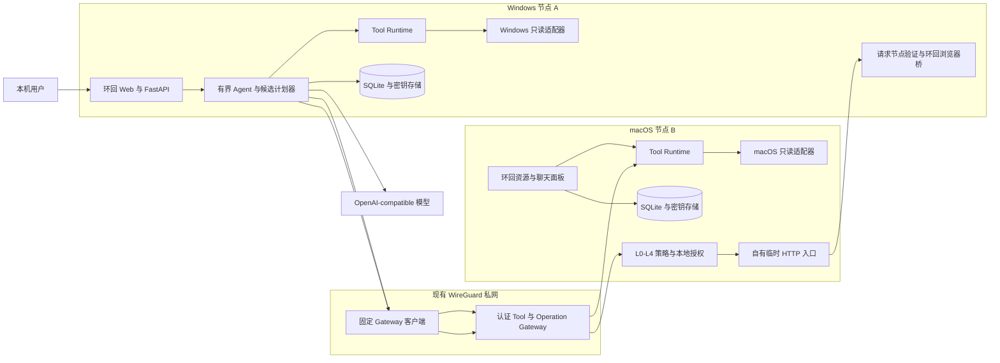
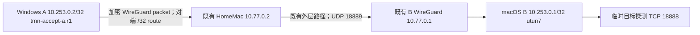

# TunnelMinion 架构

本文描述当前实现，而不是未来设想。面向项目所有者的非技术解释见
[《从零理解 TunnelMinion》](guide/从零理解-tunnelminion.md)。当前可编辑的全景图与框架启用时机
以自部署 Penpot 当前连接文件为准；本页同时链接仓库内可离线复核的 SVG 证据。

## 图纸权威与离线证据

- Penpot 是唯一可编辑的当前架构图源。已核验的总览入口是 `TunnelMinion 架构总图`；发布核对页是
  `主图 A · 当前系统架构（2026-08-12）`、`主图 B · Runtime 生命周期（2026-08-12）` 和
  `主图 C · 请求与操作审批流程（2026-08-12）`。
- 本次只读现场的页面 ID 记录为：A `3a9efb1a-235c-80d9-8008-78424c387137`、B
  `3a9efb1a-235c-80d9-8008-784296a69eec`、C `3a9efb1a-235c-80d9-8008-7842e73658dd`；三页均已于
  2026-08-12 成功导出 PNG。ID 仅用于审计定位，不是猜测出来的 URL。
- 当前 Penpot 连接器没有返回可确认的稳定公开深链，因此本文不伪造 Penpot 链接；打开自部署项目后按
  上述页面名/ID 定位即可。仓库中的 [当前主架构图 SVG](assets/architecture/architecture-01.svg)、
  [真实 A/B 路径图 SVG](assets/architecture/architecture-02.svg)、Mermaid 源和脱敏摘要/manifest
  是可审计发布证据，不能反向替代 Penpot 的编辑权威。
- 历史来源：[旧 Figma 架构图](https://www.figma.com/board/8KODvoNqXZsLCHKO0J4nbU)，仅作 provenance，
  不作为当前图源、门禁或合并 blocker。

## 运行边界



离线受审 SVG：[当前主架构图](assets/architecture/architecture-01.svg)。SVG 使用脚本内固定版本的
Mermaid CLI 与[严格离线配置](mermaid-config.json)生成，再校验源摘要、脚本、HTML、外链、事件处理器和
`foreignObject`。复核不需要 Node.js 或网络；更新源图后执行：

```powershell
uv run python scripts/validate_mermaid_docs.py docs/architecture.md --svg-dir docs/assets/architecture --config docs/mermaid-config.json --write
```

两端结构一致，但每项服务的监听范围不同：

- 本地聊天和资源面板只监听环回地址，不接受其他节点直接访问。
- Tool Gateway 只绑定显式配置的私有 WireGuard 地址，不能绑定环回、通配或公网地址。
- 模型 endpoint 属于各节点本地配置，不随 peer 配置同步。
- A/B 之间传输版本化工具请求、候选操作计划和验证结果，不传 Shell 或 Python 代码。
- 临时访问凭据只在 B 的秘密存储和 A 的验证进程内存中出现，不进入 URL、模型上下文、
  操作列表或普通日志；浏览器通过 A 的短期环回桥访问。

## 一次跨节点诊断

1. 用户在 A 的本地页面提出问题。
2. Runtime 先获取 B 的节点摘要和允许能力，再按任务加载少量远端只读工具。
3. Agent 可让模型选择工具，但注册表、风险策略、JSON Schema 和预算拥有最终执行权。
4. A 的固定客户端携带独立应用凭据，通过 WireGuard 请求 B 的 Tool Gateway。
5. B 验证 peer、工具允许列表、版本、参数、速率、超时和响应大小，再调用固定平台适配器。
6. A 将远端监听、进程、Docker、WireGuard 和本地探测合并为服务与可达性证据。
7. 最终回答引用 `tool_run_id`；关键证据缺失时保留未知，不使用模型常识补写实时状态。

用户显式指定目标端口时，A 即使没有从 B 的监听或 Docker 清单发现该端口，也会执行一次受
预算约束的 TCP 探测，并把它标成“主动探测、远端归属未知”的低置信度服务证据。它足以回答
“从 A 是否可达”，但不足以证明进程归属、监听地址或满足临时发布条件。

## Coordinator 控制面与直连数据面

Coordinator 是可选控制面，不是工具流量代理。它只接受稳定节点身份、心跳、私有 Gateway
endpoint、能力摘要、服务摘要、修订和脱敏审计；工具结果、操作正文、对话、记忆、模型密钥和
WireGuard 私钥不会进入 Coordinator。

1. B 使用一次性 enrollment token 注册，再把 refresh 凭据写入本机秘密存储；A 随后注册。
2. 两端周期同步完整能力/服务快照并缓存带新鲜度的目录和验证公钥。
3. A 只把稳定 B node ID 交给动态工具协调器；endpoint 与认证材料在模型外解析。
4. A 获取 120 秒、绑定 `tool-gateway` audience 的 Ed25519 assertion。
5. B 使用固定公钥指纹和未过期授权缓存离线验签，再返回实时能力供 A 复核。
6. Coordinator 离线时 managed 新调用失败关闭；现有 static peer、本地资源页和操作恢复继续工作。

Windows/macOS 常规本地应用现在会读取同一份版本化 `ManagedNodeConfig`。只有配置启用、稳定
`node-id`/平台一致且 refresh 凭据存在时，FastAPI lifespan 才启动三个彼此隔离的后台域：完整
服务观察、Coordinator 目录同步和签名 desired config 同步。未配置、禁用、待 enrollment 或
身份不匹配时不创建后台任务，因此升级本身不会改变现有本地/static 行为。

后台同步使用 Agent API 的认证传输；desired config 仍只进入既有治理、Provider、验证、回滚
和本机授权边界。资源页只读取聚合状态，不返回 Coordinator/Gateway 完整 endpoint、refresh、
签名正文、私钥或配置正文。Gateway 仍是独立私网进程，不共享环回应用的 lifespan 或监听器。

真实 A/B 验收只临时使用 Windows `10.77.0.2:8790`、环回 `127.0.0.1:8791` 和 B
`10.77.0.1:18888`。生产 B Gateway `8787`、模型 `8082`、WireGuard 和防火墙配置前后不变。

## 一次临时共享本机服务

1. A 先用 L0 只读工具确认 B 的 HTTP 服务只监听环回地址。
2. 用户明确确认服务、入口端口和持续时间后，模型只填写预期变化、风险、验证和回滚说明；
   节点、证据、端口、L2 等级和权限由程序固定。
3. B 重新校验计划版本、证据引用、确定性等级和实时监听身份。默认进入
   `awaiting_authorization`；只有 B 的本地用户可逐次批准或创建细粒度预授权。
4. B 创建只绑定指定 WireGuard 地址的自有 HTTP 入口和绝对到期租约。
5. B 把一次性验证请求回调给 A；A 沿实际路径携带内存中的临时凭据验证。验证失败立即回滚。
6. 成功后只显示临时地址和绝对过期时间。到期、主动撤销或恢复流程只清理指纹匹配的
   TunnelMinion 自有资源，不依赖模型在线。

## L0～L4 与安全所有权

| 等级 | 含义 | 当前行为 |
|---|---|---|
| L0 | 只读观察 | 可由有界 Agent 调用注册工具 |
| L1 | 无副作用建议 | 只输出建议，不执行系统动作 |
| L2 | 低风险、可逆、限时操作 | 临时共享 HTTP；目标节点批准或完整预授权 |
| L3 | 敏感操作 | 当前拒绝 |
| L4 | 禁止操作 | Shell、任意代码、秘密读取等始终拒绝 |

| 决策 | 最终所有者 |
|---|---|
| 模型建议下一步查什么 | LangChain Agent 与模型 |
| 工具是否存在、可见、只读且适合当前平台 | `ToolRegistry` |
| 参数、超时、取消、并发和结果大小 | `ToolRuntime` |
| 对端身份、允许列表、速率和私网绑定 | Tool Gateway |
| 系统实际读取方式 | Windows/macOS 固定适配器 |
| 上下文中能出现什么 | `ContextBuilder` 与数据分类规则 |
| 实时结论是否有证据 | 诊断工作流和评估门禁 |
| 候选计划是否可提交 | 固定 schema、证据引用、计划版本与确定性等级 |
| L2 是否可执行 | B 的本地批准或细粒度预授权 |
| 临时资源是否可删除 | 租约、资源所有权指纹与恢复器 |
| 成功是否成立 | A 的独立回调验证，不接受 B 自报成功 |

默认运行和现有 A/B 生产路径仍不修改 WireGuard、路由、防火墙、原服务或 Docker。仓库已经
实现受管 WireGuard 的 L3 Provider、配置 saga 和路径控制器，但它们只能管理具有双重所有权
证据的独立资源，并继续受本机批准门禁约束。真实 A/B 曾在一次性明确授权下完成隔离接口验收；
这不启用默认写能力，也不授权后续变更。当前常规产品写路径仍只有创建和清理 TunnelMinion
自有的限时 HTTP 代理资源。

## 受管连接 Harness 与模型边界

受管连接沿 `signed desired config → local policy → provider plan → apply receipts → independent
verify → rollback/recover` 收敛。地址、route、endpoint、revision 和授权都来自结构化控制面
与本机策略，不从聊天文本、Prompt、记忆或模型输出读取。

路径控制器只把新鲜 handshake、精确 host route 和目标探测同时通过的候选标为 `direct`。
relay 没有三节点证据时保持 `static/degraded`；控制面离线时保留 last-known-good 和 static
peer。模型可为状态生成解释，但启用或禁用模型后，Provider 计划哈希、授权、执行、验证、
回滚和路径选择必须完全相同。固定故障矩阵与指标见
[受管连接第 9 阶段证据映射](../evaluations/reports/managed-connectivity-assurance-evidence-map-2026-07-26.md)。

### 真实 A/B 验收路径



离线受审 SVG：[真实 A/B 路径图](assets/architecture/architecture-02.svg)。

`HomeMac` 与 B 原 `utun4` 只是新 WireGuard 会话的外层可达路径，不归本次 Provider 所有。
只有新鲜 handshake、对端 `/32` route 和 A 发起的目标探测同时通过时才标记 `direct`。
真实执行、失败恢复与清理证据见
[受管连接 A/B 真机验收](../evaluations/reports/managed-connectivity-ab-acceptance-2026-07-29.md)。

## Prompt、Context 与 Harness 分层

| 层 | 当前责任 | 确定性边界 |
|---|---|---|
| Prompt | 注册任务模板、输入字段、语义版本和内容哈希 | 文本不能授权工具或操作 |
| Context | 组装当前消息、近期历史、摘要、工作流状态、记忆、工具结果、制品和事实证据 | 实时证据优先于记忆和历史；各类内容独立预算 |
| Agent Runtime | 运行有界模型循环、按本次任务动态选择工具、生成公开回答 | 轮次、工具数、token、取消和停止原因受控 |
| Tool Runtime | 注册、schema 校验、平台适配、超时、大小和审计 | 只执行注册的 L0 工具，不接受模型生成代码 |
| Harness | Provider、ContextBuilder、工具协议、checkpoint、降级、恢复和评估的整体外壳 | 模型失败不得绕过工具、治理或资源所有权 |
| 治理 | L0～L4、目标节点批准、预授权、租约与所有权 | 模型不拥有批准权 |
| 可观测性 | 记录脱敏组成、预算、裁剪、版本、失败分类和资源指标 | 不保存秘密、认证头或远端完整正文 |

模型响应时间和解释质量会直接影响聊天体验；真实双机验收中，连续两轮本地对话约 37.8 秒，
跨节点诊断约 38.2 秒。端口可达性、事实优先级、参数校验、权限、回滚与是否允许执行由确定性
代码决定，因此更换为外部 API 可以改善速度或表达，但不能替代 Harness 门禁。

## 相关决策

- [ADR-0001：远端工具传输](adr/0001-remote-tool-transport.md)
- [ADR-0002：工具风险与执行边界](adr/0002-tool-risk-and-execution-boundary.md)
- [ADR-0003：上下文、checkpoint 与长期记忆](adr/0003-context-checkpoint-and-memory.md)
- [ADR-0004：跨节点应用认证](adr/0004-cross-node-application-authentication.md)
- [ADR-0005：临时 HTTP 共享](adr/0005-temporary-http-sharing.md)
- [ADR-0006：Coordinator 身份、目录与数据面分离](adr/0006-coordinator-identity-and-directory.md)
- [标准概念映射](guide/Prompt-Context-Harness概念映射.md)
- [Context、Prompt 与 Runtime 评估指南](guide/上下文与Prompt评估指南.md)
- [受管连接恢复、人工干预与卸载](guide/受管连接恢复与卸载.md)
- [常规 managed node 最终验收](../evaluations/reports/managed-node-runtime-final-acceptance-2026-07-31.md)
- [威胁模型](security/threat-model.md)
- [数据分类与保留](security/data-classification.md)
