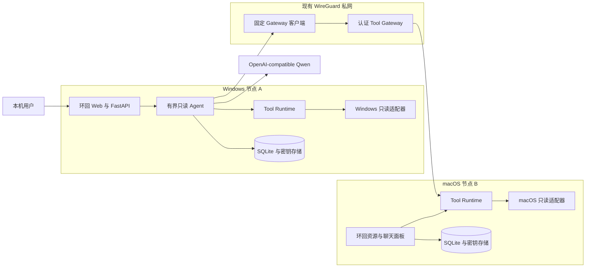

# TunnelMinion MVP 架构

本文描述当前实现，而不是未来设想。面向项目所有者的非技术解释见
[《从零理解 TunnelMinion》](guide/从零理解-tunnelminion.md)，可编辑的全景图与框架启用时机见
[FigJam](https://www.figma.com/board/8KODvoNqXZsLCHKO0J4nbU)。

## 运行边界

两端结构一致，但每项服务的监听范围不同：

- 本地聊天和资源面板只监听环回地址，不接受其他节点直接访问。
- Tool Gateway 只绑定显式配置的私有 WireGuard 地址，不能绑定环回、通配或公网地址。
- 模型 endpoint 属于各节点本地配置，不随 peer 配置同步。
- A/B 之间传输的是版本化工具请求和结构化结果，不是 Shell、Python 代码或浏览器凭据。

## 一次跨节点诊断

1. 用户在 A 的本地页面提出问题。
2. Runtime 先获取 B 的节点摘要和允许能力，再按任务加载少量远端只读工具。
3. Agent 可让模型选择工具，但注册表、风险策略、JSON Schema 和预算拥有最终执行权。
4. A 的固定客户端携带独立应用凭据，通过 WireGuard 请求 B 的 Tool Gateway。
5. B 验证 peer、工具允许列表、版本、参数、速率、超时和响应大小，再调用固定平台适配器。
6. A 将远端监听、进程、Docker、WireGuard 和本地探测合并为服务与可达性证据。
7. 最终回答引用 `tool_run_id`；关键证据缺失时保留未知，不使用模型常识补写实时状态。

## 安全所有权

| 决策 | 最终所有者 |
|---|---|
| 模型建议下一步查什么 | LangChain Agent 与模型 |
| 工具是否存在、可见、只读且适合当前平台 | `ToolRegistry` |
| 参数、超时、取消、并发和结果大小 | `ToolRuntime` |
| 对端身份、允许列表、速率和私网绑定 | Tool Gateway |
| 系统实际读取方式 | Windows/macOS 固定适配器 |
| 上下文中能出现什么 | `ContextBuilder` 与数据分类规则 |
| 实时结论是否有证据 | 诊断工作流和评估门禁 |

架构不包含任何修改 WireGuard、路由、服务、容器、文件或端口转发的路径。

## 相关决策

- [ADR-0001：远端工具传输](adr/0001-remote-tool-transport.md)
- [ADR-0002：工具风险与执行边界](adr/0002-tool-risk-and-execution-boundary.md)
- [ADR-0003：上下文、checkpoint 与长期记忆](adr/0003-context-checkpoint-and-memory.md)
- [ADR-0004：跨节点应用认证](adr/0004-cross-node-application-authentication.md)
- [威胁模型](security/threat-model.md)
- [数据分类与保留](security/data-classification.md)
