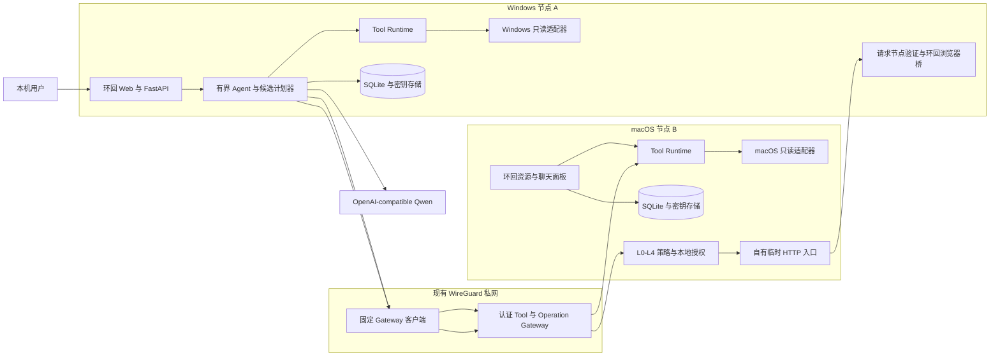

# TunnelMinion 架构

本文描述当前实现，而不是未来设想。面向项目所有者的非技术解释见
[《从零理解 TunnelMinion》](guide/从零理解-tunnelminion.md)，可编辑的全景图与框架启用时机见
[FigJam](https://www.figma.com/board/8KODvoNqXZsLCHKO0J4nbU)。

## 运行边界

两端结构一致，但每项服务的监听范围不同：

- 本地聊天和资源面板只监听环回地址，不接受其他节点直接访问。
- Tool Gateway 只绑定显式配置的私有 WireGuard 地址，不能绑定环回、通配或公网地址。
- 模型 endpoint 属于各节点本地配置，不随 peer 配置同步。
- A/B 之间传输版本化工具请求、候选操作计划和验证结果，不传 Shell 或 Python 代码。
- 临时访问凭据只在 B 的秘密存储和 A 的验证进程内存中出现，不进入 URL、模型上下文、
  操作列表或普通日志；浏览器通过 A 的短期环回桥访问。

## 一次跨节点诊断

1. 用户在 A 的本地页面提出问题。
2. Runtime 先获取 B 的节点摘要和允许能力，再按任务加载少量远端只读工具。
3. Agent 可让模型选择工具，但注册表、风险策略、JSON Schema 和预算拥有最终执行权。
4. A 的固定客户端携带独立应用凭据，通过 WireGuard 请求 B 的 Tool Gateway。
5. B 验证 peer、工具允许列表、版本、参数、速率、超时和响应大小，再调用固定平台适配器。
6. A 将远端监听、进程、Docker、WireGuard 和本地探测合并为服务与可达性证据。
7. 最终回答引用 `tool_run_id`；关键证据缺失时保留未知，不使用模型常识补写实时状态。

## 一次临时共享本机服务

1. A 先用 L0 只读工具确认 B 的 HTTP 服务只监听环回地址。
2. 用户明确确认服务、入口端口和持续时间后，模型只填写预期变化、风险、验证和回滚说明；
   节点、证据、端口、L2 等级和权限由程序固定。
3. B 重新校验计划版本、证据引用、确定性等级和实时监听身份。默认进入
   `awaiting_authorization`；只有 B 的本地用户可逐次批准或创建细粒度预授权。
4. B 创建只绑定指定 WireGuard 地址的自有 HTTP 入口和绝对到期租约。
5. B 把一次性验证请求回调给 A；A 沿实际路径携带内存中的临时凭据验证。验证失败立即回滚。
6. 成功后只显示临时地址和绝对过期时间。到期、主动撤销或恢复流程只清理指纹匹配的
   TunnelMinion 自有资源，不依赖模型在线。

## L0～L4 与安全所有权

| 等级 | 含义 | 当前行为 |
|---|---|---|
| L0 | 只读观察 | 可由有界 Agent 调用注册工具 |
| L1 | 无副作用建议 | 只输出建议，不执行系统动作 |
| L2 | 低风险、可逆、限时操作 | 临时共享 HTTP；目标节点批准或完整预授权 |
| L3 | 敏感操作 | 当前拒绝 |
| L4 | 禁止操作 | Shell、任意代码、秘密读取等始终拒绝 |

| 决策 | 最终所有者 |
|---|---|
| 模型建议下一步查什么 | LangChain Agent 与模型 |
| 工具是否存在、可见、只读且适合当前平台 | `ToolRegistry` |
| 参数、超时、取消、并发和结果大小 | `ToolRuntime` |
| 对端身份、允许列表、速率和私网绑定 | Tool Gateway |
| 系统实际读取方式 | Windows/macOS 固定适配器 |
| 上下文中能出现什么 | `ContextBuilder` 与数据分类规则 |
| 实时结论是否有证据 | 诊断工作流和评估门禁 |
| 候选计划是否可提交 | 固定 schema、证据引用、计划版本与确定性等级 |
| L2 是否可执行 | B 的本地批准或细粒度预授权 |
| 临时资源是否可删除 | 租约、资源所有权指纹与恢复器 |
| 成功是否成立 | A 的独立回调验证，不接受 B 自报成功 |

架构仍不修改 WireGuard、路由、防火墙、原服务或 Docker。唯一写路径是创建和清理
TunnelMinion 自有的限时 HTTP 代理资源。

## 相关决策

- [ADR-0001：远端工具传输](adr/0001-remote-tool-transport.md)
- [ADR-0002：工具风险与执行边界](adr/0002-tool-risk-and-execution-boundary.md)
- [ADR-0003：上下文、checkpoint 与长期记忆](adr/0003-context-checkpoint-and-memory.md)
- [ADR-0004：跨节点应用认证](adr/0004-cross-node-application-authentication.md)
- [ADR-0005：临时 HTTP 共享](adr/0005-temporary-http-sharing.md)
- [标准概念映射](guide/Prompt-Context-Harness概念映射.md)
- [威胁模型](security/threat-model.md)
- [数据分类与保留](security/data-classification.md)
