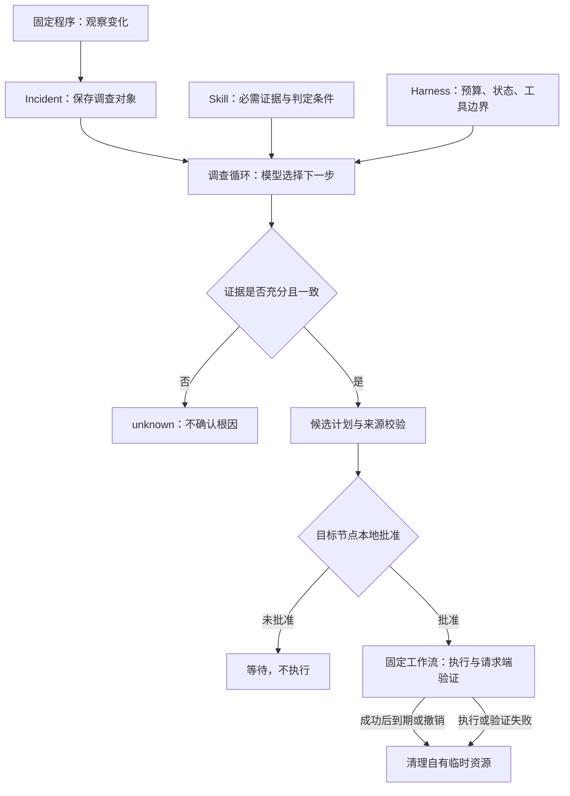

# Incident 受控恢复开发者演示

这是一条非特权、隔离的开发者演示。生产观察器处理模拟监听证据并产生 Incident，随后同一份
`OperationPlan` 沿现有生产对象串到目标节点本地批准、执行、请求端独立验证和租约到期清理。

在仓库根目录运行：

```powershell
$env:PYTHONUTF8='1'; uv run pytest tests/evaluation/test_incident_repair_chain.py -s -q --no-cov
```

终端会依次显示：

0. 本次是隔离模拟演示，模型、网络和共享资源使用测试替身；
1. 事件 ID（稳定的 `dedup_key`）和 Incident ID；
2. `service.local-only@1` 的 Skill 证据覆盖率；
3. 候选计划及其 `operation_id`；
4. 目标批准前没有写调用、没有自有资源；
5. 目标本地批准后，请求端独立验证通过；
6. 同一操作租约到期后，自有资源和临时凭据均为 0。

## 演示边界

- 使用真实观察器、Incident 调查、SQLite 聚合、请求端编排、目标端提交/授权服务、操作工作流和验证回调
  路由。
- 模型响应、双机网络、临时共享适配器和目标服务健康响应使用已有确定性测试替身；因此本演示不代表
  真实模型或真实双机验收。
- 不启动私网服务，不修改 WireGuard、防火墙、DNS、路由或生产服务，不读取外部秘密。
- 全仓覆盖率由独立质量门禁负责；单条演示命令使用 `--no-cov`，避免把单个纵切误当全仓覆盖率结果。

## 十分钟讲解顺序

命令本身不需要运行十分钟；十分钟用于结合六段输出解释系统。首次运行需安装锁定的开发依赖，后续运行不需要模型密钥或第二台机器。

| 时间 | 看哪里 | 讲清什么 |
|---|---|---|
| 0–2 分钟 | 阶段 1 的事件与 Incident ID | 构造服务从网络可见变成仅回环可见的快照变化。观察器和差异检测器负责发现变化，不靠模型持续轮询。 |
| 2–4 分钟 | 阶段 2 的 `4/4` | Skill 规定进程、监听、私网和请求端可达性四类证据；Harness 管理工具范围、预算、证据和停止条件。本命令用脚本响应替代模型决策。 |
| 4–6 分钟 | 阶段 3、4 的计划与零写入 | 调查结论只是候选操作的来源。后端重新校验目标服务，未获目标端批准时不执行；模型不能自行批准。 |
| 6–8 分钟 | 阶段 5 的验证通过 | 测试调用真实本地批准 API，模拟用户决定；随后真实工作流执行，回调请求端验证。本演示的网络健康响应与共享资源为模拟值。 |
| 8–10 分钟 | 阶段 6 的 `expired` 与归零 | 推进测试时间触发租约到期，清理目标自有资源和临时凭据，再刷新请求端状态。临时恢复不是修改原服务绑定，也不等于故障根治。 |



图中的模型选择在本命令中由 scripted provider 替代；批准由测试调用 API 模拟，不是交互式人工点击。失败分支由既有操作工作流测试覆盖，本条演示实跑的是批准前拒绝、批准后成功及到期清理。

## 可以与不能据此声称的结果

本演示证明同一 Incident、候选计划和操作 ID 穿过现有生产对象并完成状态闭环。它没有验证真实模型诊断准确率、物理网络连通性或生产部署；这些不能由 `1 passed` 推导。

模型决策效果另看[固定 DeepSeek A/B 报告](../../evaluations/reports/incident-ab-deepseek-2026-09-30/summary.md)，完整口径是固定工具环境下 15 场景、每侧三轮，不是本条演示的测量结果。项目中的分布式首先指跨节点工具执行与目标端授权，并不等于多 Agent。
