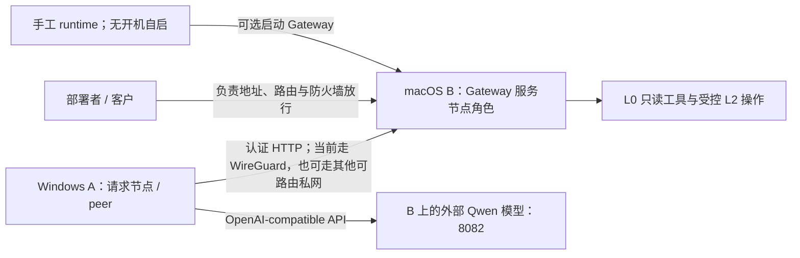
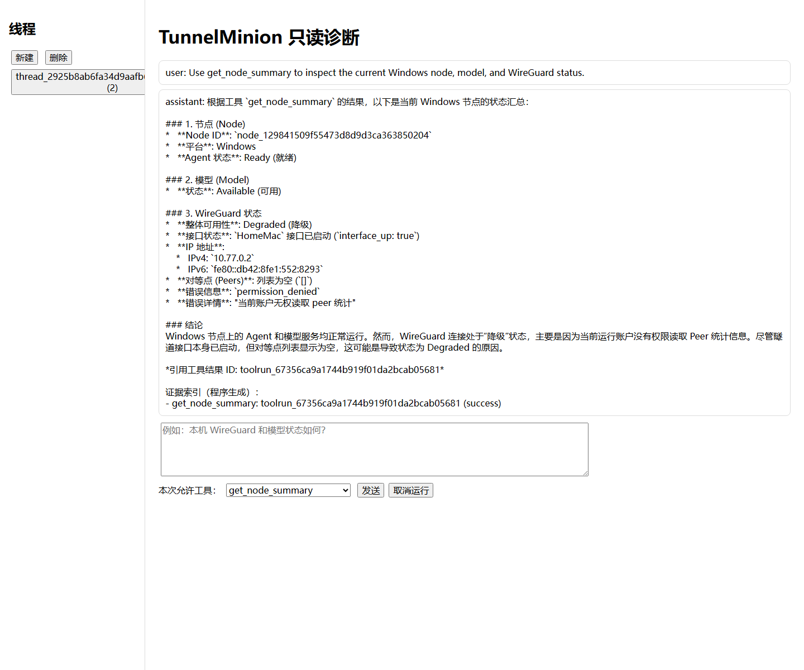
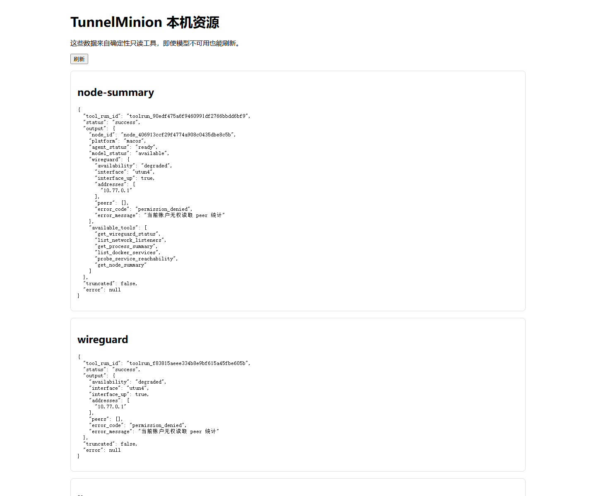

# TunnelMinion 真实双机人工验收

本文记录 2026-07-18 在 Windows A 与 macOS B 上完成的可重复人工验收。它只保存节点 ID、
服务端口、工具运行 ID、状态、耗时和 token 统计；不保存 Gateway token、认证头、API Key、
WireGuard 私钥、完整进程列表或原始工具正文。

配套可编辑图：[TunnelMinion 全景架构与框架分工（FigJam）](https://www.figma.com/board/A8vpOsb7jTIx8TozXVmMCY)

## 验收拓扑



- A：Windows，WireGuard 地址 `10.77.0.2`，本机面板 `127.0.0.1:8765`。
- B：macOS，WireGuard 地址 `10.77.0.1`，本机面板 `127.0.0.1:8765`。
- B Tool Gateway：`10.77.0.1:8787`，只接受已配置 peer 的应用层 token。
- Qwen：Windows 从 `10.77.0.1:8082/v1` 访问；Mac 从 `127.0.0.1:8082/v1` 访问。
- 两端模型均不需要 API Key。

## 1. 验证两端本地资源和聊天

分别在 A、B 打开：

```text
http://127.0.0.1:8765/resources
http://127.0.0.1:8765/chat
```

在聊天页只允许 `get_node_summary`，询问本机节点、模型和 WireGuard 状态。验收通过条件：

1. 回答中的节点、平台和模型状态与工具结果一致。
2. 权限不足时明确显示 `permission_denied`，不猜测 peer 统计。
3. 回答包含由程序生成的 `tool_run_id` 证据索引。
4. 资源页在模型不可用时仍能刷新。

Windows A 真机对话使用 2 个模型轮次和 1 次只读工具调用；macOS B 也使用 2 个模型轮次和
1 次 `get_node_summary`，两端均正确报告模型可用和 WireGuard 统计权限降级。





截图只展示节点摘要、接口地址、允许工具和证据 ID，不包含认证材料。Mac 截图通过临时 SSH
本地端口转发读取原本只绑定环回地址的页面；截图完成后转发已停止，未修改 Mac 服务配置。

## 2. 验证 A 查询 B 的真实服务

在 A 的项目目录执行：

```shell
uv run python scripts/run_real_cross_node_diagnostic.py \
  --endpoint http://10.77.0.1:8787 \
  --remote-node-id node_406913ccf29f4774a908c0435dbe8c5b \
  --target-host 10.77.0.1 \
  --question "请告诉我 B 节点发现了哪些服务、哪些端口能从 A 访问，并解释证据不足的地方。" \
  --output evaluations/platform/ab-cross-node-diagnostic-2026-07-18.json
```

2026-07-18 的真实结果：

| B 服务 | 端口 | A 侧探测 |
|---|---:|---|
| `baota` | 80 | `unreachable` |
| `baota` | 443 | `unreachable` |
| `obsidian-couchdb` | 5984 | `reachable` |
| `baota` | 8888 | `reachable` |

Docker 同时报告 IPv4/IPv6 通配绑定时，程序会合并为一个逻辑服务，避免用一次 IPv4 探测重复
证明 IPv6。macOS 无权枚举完整监听列表，因此报告把 `list_network_listeners` 放入
`unavailable_sources`，服务置信度保持为 `low`。本次完整诊断耗时约 47.5 秒，使用 4156
tokens；确定性工具轨迹和模型解释见
[脱敏 A/B 诊断报告](../../evaluations/platform/ab-cross-node-diagnostic-2026-07-18.json)。

## 3. 验证单节点模型故障隔离

下面的脚本临时删除 A 的无 Key 模型配置，在 `finally` 中恢复原 endpoint、模型名和超时：

```shell
uv run python scripts/run_model_failure_isolation.py \
  --remote-endpoint http://10.77.0.1:8787 \
  --local-node-id node_129841509f55473d8d9d3ca363850204 \
  --remote-node-id node_406913ccf29f4774a908c0435dbe8c5b \
  --output evaluations/platform/model-failure-isolation-2026-07-18.json
```

验收通过条件和真机结果：

- A 模型状态变为 `unconfigured`，新 AI run 返回 HTTP 503。
- A 的节点摘要仍返回 HTTP 200、工具状态 `success`。
- A 仍能通过认证 Gateway 调用 B 的 `get_node_summary`。
- 脚本恢复 Qwen 后模型状态为 `available`，AI run 可用性恢复 HTTP 200。

完整脱敏结果见
[模型故障隔离报告](../../evaluations/platform/model-failure-isolation-2026-07-18.json)。如果原配置
包含 API Key，脚本会在删除前拒绝运行，避免删除无法自动恢复的凭据。

## 4. 验证环回、节点离线与 Docker 不可用

发布到 B `127.0.0.1:18080` 的临时容器服务被 A 正确识别为 `local-only`；临时停止 B
Gateway 后，A 在约 2.1 秒内返回 `node_unreachable`，且不调用模型补写服务；Gateway 使用
不存在的 `DOCKER_HOST` 启动时，节点摘要和认证仍成功，但监听与 Docker 来源明确降级，答案
保留未知。随后临时容器被删除，正常 Gateway 和 Docker 均恢复。

完整场景、故障注入和恢复证据见
[A/B 真机失败矩阵](../../evaluations/reports/ab-real-failure-matrix-2026-07-18.md)。

## 5. 验收后的清理与复核

1. 确认 A 的 `/api/model-config` 为 `available`。
2. 确认 B 的 `8787` 和本地 `8765` 仍由原进程监听。
3. 确认临时 `8766` 服务和 SSH `8767` 转发均已停止。
4. 运行 `uv run python scripts/security_scan.py --root .`。
5. 运行 `uv run python scripts/quality.py all`。

本轮验收后，自动测试、严格类型检查、源代码与分支覆盖率、安全扫描，以及 GitHub Actions 的
Windows/macOS 作业均通过。

## 6. 2026-07-25 Context Runtime 综合验收

本轮继续使用正式 Gateway `10.77.0.1:8787` 和模型服务 `10.77.0.1:8082`，没有创建新的
监听端口。先运行显式目标端口诊断：

```shell
uv run python scripts/run_real_cross_node_diagnostic.py \
  --endpoint http://10.77.0.1:8787 \
  --remote-node-id node_406913ccf29f4774a908c0435dbe8c5b \
  --target-host 10.77.0.1 \
  --question "请基于当前实时证据说明 B 节点的 8082 模型服务是否能从 A 访问，并明确引用证据。" \
  --port 8082 \
  --output evaluations/platform/ab-context-runtime-diagnostic-2026-07-25.json
```

A 成功调用 B 的节点摘要、监听、进程和 Docker 四项只读工具，并从 A 实际探测
`10.77.0.1:8082` 为 `reachable`。即使 macOS 权限没有在监听清单中枚举到该端口，报告仍保留
主动探测证据，并明确把服务归属标为 `unknown/low`，不据此生成发布计划。

随后运行同一 thread 的两轮真实对话和事实优先级验收：

```shell
uv run python scripts/run_real_context_runtime_acceptance.py \
  --diagnostic evaluations/platform/ab-context-runtime-diagnostic-2026-07-25.json \
  --output evaluations/platform/ab-context-runtime-acceptance-2026-07-25.json \
  --check
```

验收结果：

| 检查项 | 结果 |
|---|---|
| 同一 thread 连续两轮、4 条公开消息 | 通过 |
| 第一轮从 3 个候选中选择节点摘要和 WireGuard | 通过 |
| 第二轮只选择 `probe_service_reachability` | 通过 |
| 远端四项只读诊断成功 | 通过 |
| 实时 `8082` 覆盖历史旧值 `8080` | 通过 |
| 最终回答引用主动探测证据 ID | 通过 |
| Context/Prompt/Tool/Governance 运行时失败 | 0 |

连续对话两轮共约 37.8 秒；跨节点诊断约 38.2 秒；三段模型调用合计 8963 tokens。模型的速度
会影响等待时间，模型解释质量会影响可读性，但工具选择范围、TCP 结果、事实优先级和发布资格
由确定性 Runtime 决定。

## 7. 2026-07-26 Coordinator A/B 迁移验收

本轮在隔离目录运行 Coordinator，Agent API 只绑定 `10.77.0.2:8790`，管理员 API 只绑定
`127.0.0.1:8791`；B 只临时使用 Murus 已放行范围内的 `10.77.0.1:18888`。注册顺序固定为
B 后 A，一次性 enrollment token 在 B 读取后立即删除。

真机结果：

| 场景 | 结果 |
|---|---|
| B、A 注册并同步 6 项 B 能力 | 通过 |
| enrollment token 更换身份重放 | HTTP 401 |
| 目录选择 B、assertion、直连复核 | 通过 |
| managed `get_node_summary` | `success`，保留 `tool_run_id` |
| managed 隔离环境监听器与节点摘要 | 均为 `success`，分别保留 `tool_run_id` |
| A 撤销、Coordinator 离线、缓存到期 | 全部失败关闭 |
| Gateway 协议主版本不兼容 | HTTP 409 |
| Coordinator 离线后的 static peer 回退 | 生产 8787 可用；5 项成功、Docker 明确降级 |
| B 模型 8082、生产 Gateway 8787 | A 视角前后均可达 |
| 临时 18888 | 验收前后均关闭 |

验收还发现并修复了真实分布式时钟边界：A 比 B 快约 1 秒时，原离线验签会把合法 assertion
判为“来自未来”。当前只容忍 5 秒未来签发/key 激活偏差，固定 120 秒到期仍不延长。

完整脱敏证据见
[Coordinator A/B 报告](../../evaluations/platform/coordinator-ab-acceptance-2026-07-26.json) 和
[场景—测试—证据对照](../../evaluations/reports/coordinator-ab-evidence-map-2026-07-26.md)。

## 常规 managed node 入口最终验收

本项验证 Windows/macOS 不再依赖专用 managed-node 进程，而是通过普通 `tunnelminion` 本地应用
完成 enrollment、心跳、服务目录、managed config、无模型和 Coordinator 离线降级。脚本默认
只有“打印授权清单”一种行为，不连接 SSH、不创建目录、不监听端口：

```powershell
uv run python scripts/run_managed_node_runtime_ab_acceptance.py `
  --ssh-target 10.77.0.1
```

清单必须由节点所有者核对。它只申请临时使用 A `10.77.0.2:8790`、A 管理环回 `8791`、两端
环回 `18765`、A 当前账户临时目录和 B `/tmp/tunnelminion-managed-runtime-ab.*`。它不申请任何
Provider/L3 写入，不修改 `HomeMac`、B 手写 WireGuard、Murus/防火墙、用户 route、生产
Gateway `8787` 或模型 `8082`。

获得这一次明确授权后才可加入执行开关：

```powershell
uv run python scripts/run_managed_node_runtime_ab_acceptance.py `
  --ssh-target 10.77.0.1 `
  --execute-approved `
  --output evaluations/platform/managed-node-runtime-real-ab-2026-07-31.json
```

脚本会保存配置/接口/route/防火墙只读摘要哈希以及 `8082`、`8787` 前后状态，停止进程后只删除
经过固定前缀校验的临时目录。报告明确排除 enrollment token、refresh、认证头、私钥和配置正文。

Murus 规则正文没有稳定的非交互只读接口，也不会在 GUI 中直接提供 SHA-256。验收不要求操作者
手工导出或截图：脚本自动比较 `pfctl` 与 macOS Application Firewall 的可观察状态哈希和读取
返回码，并明确记录没有读取 Murus 配置正文、没有调用任何 Murus/PF/防火墙写命令。若当前权限
无法读取 PF 规则正文，报告会如实标记该限制，不把空输出冒充规则哈希。

正式执行前还会先检查 `HomeMac`，并记录生产模型 `8082` 和 Gateway `8787` 当前是开启还是关闭。
`HomeMac` 基线不满足时脚本立即生成失败报告并退出，不创建远端临时目录、不启动 Coordinator
或常规应用；`8082`、`8787` 不要求为了验收临时启动，只要求结束后与开始前一致。最终 `passed`
只在常规入口自动验收通过、前后快照一致且生产网络基线有效时为 `true`。

## 2026-08-08 macOS Gateway runtime health 验收

本轮验证手工运行包的 Gateway 本地 lifecycle 与 peer accepted 已经分域。Gateway 在产品上是节点
角色；本轮仍由 macOS B 承担该角色并使用现有 WireGuard endpoint，结论同样适用于部署者提供的
局域网、企业 VPN 或其他可路由 endpoint。Coordinator 未配置，不是本轮验收门禁。

| 检查项 | 结果 |
|---|---|
| runtime-managed 候选脱离终端启动 | 本地 `running`，Gateway 与本地应用监听器所有权通过 |
| 真实总 deadline | 9.834 秒启动完成，计入探针、等待和稳定窗口 |
| Windows A 独立 peer 验收 | 连续三次无 token `401`，`peer_reachable/accepted` |
| 重复 start 与新会话 status | PID 保持，状态仍为 `running` |
| 正常 stop、监听器消失与新会话 stopped | 通过；只终止已证明自有的进程 |
| 客户网络与数据边界 | 防火墙只读摘要、route/接口、配置、SecretStore、模型和零自启动保持不变 |
| 验收后状态 | 按计划恢复切换前 direct Gateway；候选未安装，accepted 指针未改变 |

当前 macOS 的精确 executable 已由用户人工许可；TunnelMinion 没有写防火墙，也不要求 Murus 或
防火墙日志读取权限。日志可用时只保存脱敏摘要，不可用时仍以本地所有权和真实 peer 请求判定。
完整脱敏证据见
[runtime health 最终报告](../../evaluations/platform/runtime-health-production-final-2026-08-08.json)。
