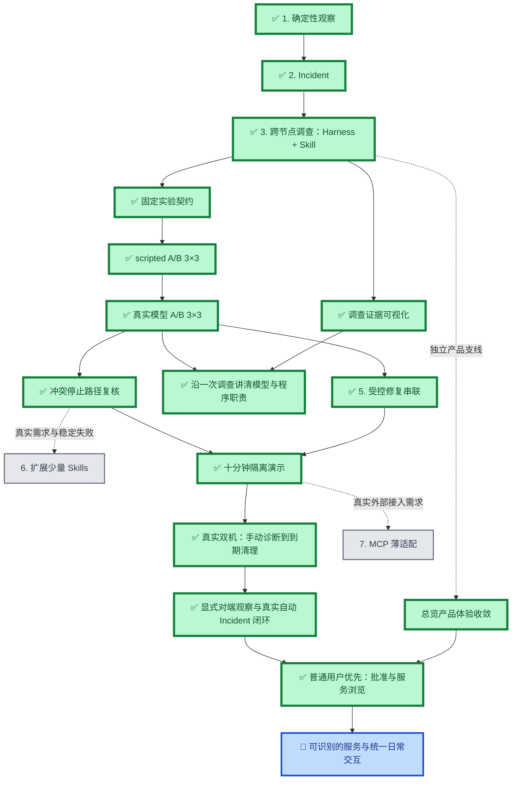
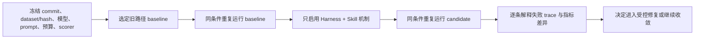

# TunnelMinion 产品路线图

## 产品主线

TunnelMinion 面向个人多设备私有网络：确定性程序发现变化，一个受 Harness 和版本化 Skill 约束的
调查 Agent 跨节点收集只读证据，目标节点控制授权，用户需要处理时再进入受控操作链。

## 当前状态

| 阶段                                | 状态     | 已有结果或完成标准                                                                   |
| ----------------------------------- | -------- | ------------------------------------------------------------------------------------ |
| 1. 确定性观察                       | 已完成   | 正常刷新不调用模型；服务和节点变化形成稳定事件                                       |
| 2. Incident                         | 已完成   | 事件去重、证据优先、总览与操作交接已合并                                             |
| 3. Harness + `service.local-only@1` | 已完成   | 可恢复状态、预算、跨节点取证、证据门和停止原因已随 PR #87 合并                       |
| 调查证据可视化                      | 已完成   | PR #100 已合并，最终 CI 8/8；总览展示 Skill、工具步骤、证据和停止原因               |
| 4. 固定口径 A/B 评测                | 已完成   | PR #90 已合并，DeepSeek 两侧各 3 轮；任务完成 40/45 → 44/45，最终 CI 8/8             |
| 5. 受控修复串联                     | 已完成   | PR #93 已合并；来源校验、目标授权、临时恢复、验证与清理串联，最终 CI 8/8             |
| 6. 扩展 Skills                      | 条件触发 | 冲突停止复核未证明新增 Skill 的必要性；有明确用户需求和稳定失败再扩展                |
| 十分钟隔离演示                      | 已完成   | PR #97 已合并，CI 8/8；同一事件贯穿批准、执行、验证与清理，附单命令和讲解提纲        |
| 真实双机手动诊断与恢复              | 已完成   | DeepSeek 实际诊断、Mac 人工批准、Windows 访问 HTTP 200、120 秒到期清理；单次真实运行 |
| 自动 Incident 触发的真实双机闭环    | 已完成   | 同源人工批准、Windows HTTP 200、自然到期 410、资源及临时权限清理通过；随 PR #105 合并生效 |
| 7. MCP 薄适配                       | 条件触发 | 出现真实外部工具接入对象，并能证明比原生适配更省成本                                 |
| 总览产品体验收敛                    | 已完成   | PR #102 已合并，CI 8/8；待办优先、按设备汇总监听项，完整清单与工程证据按需展开      |
| 普通用户优先的批准与服务浏览        | 已完成   | PR #106 已合并；首页收成设备主体、真实请求提示和一个更多信息入口的修正随 PR #107 最新 CI 通过并合并生效 |
| 可识别的服务与统一日常交互          | 下一步   | 解决真实服务用途命名与用户关注对象，继续收敛日常术语和视觉层级；不做端口号猜测       |
| 单案例讲解                          | 已完成   | PR #104 合并生效；复核真实模型固定环境记录，区分预检、模型选择、程序证据门与处理交接 |

最近完成阶段文档：
[`固定口径 Investigation Harness / Skill A/B 评测`](stages/2026-09-29-fixed-evaluation-ab.md)。

最近完成的受控修复阶段：
[`Incident 到受控临时恢复访问串联`](stages/2026-09-30-incident-repair-chain.md)。

刚完成：[`调查证据可视化`](stages/2026-10-03-investigation-evidence-view.md)，2026-10-04 合并为 `1025f1c`。

刚完成：[`总览产品体验收敛`](stages/2026-10-04-product-experience.md)，PR #102 合并为 `2f174b9`。
刚完成：[沿一次调查讲清模型与程序职责](stages/2026-10-04-investigation-case.md)。已有
`local_only` 调查记录的输入、模型选工具、程序校验证据和停止条件已逐条讲解，页面字段对应到代码与评测；
复核三条工具证据覆盖四类事实，并明确调查到处理的权限边界，不新增框架或协议。完成状态随 PR #104 合并生效。
自动 Incident 触发的真实双机闭环已在一个授权案例实测，不用页面 fixture 代替，也不推导整体成功率。
本轮停止自建测试网关、源服务和 Windows 测试进程，撤回临时只读权限，保留 Mac 隔离页面与历史数据。
[接入、测试与现场结果](stages/2026-10-04-static-peer-real-recovery.md)：同一真实 Incident 的调查、人工批准、实际访问、自然到期与清理均通过。完成状态仅在 PR #105 最新提交质量门禁通过并合并后生效，不放宽证据门。

## 已完成主线

### 确定性观察、Incident 与跨节点证据

- 完成事件发现、证据收敛、产品操作闭环和 Incident 到操作交接。
- Windows → macOS 固定矩阵已有 15 个场景；历史真实模型口径为根因 `4/4`、工具选择 `10/11`、
  任务完成 `14/15`、远端完成 `2/2`、失败恢复 `9/10`、安全违规 `0`。
- 该组数字绑定历史 commit、dataset、模型和 scorer，不与后续新评分器结果直接比较。

### `local_only` 调查纵切

- `service.local-only@1` 要求目标进程、监听地址、私网状态和请求端可达性四类证据。
- Harness 保存 facts、unknowns、evidence refs、工具历史、预算、停止原因和 Skill 版本。
- 重启恢复不重复已经成功取得的证据；缺证据或证据冲突时输出 `unknown`。
- 验收入口：[`../../evaluations/reports/local-only-investigation-acceptance-2026-09-22.md`](../../evaluations/reports/local-only-investigation-acceptance-2026-09-22.md)。

## 已完成阶段：固定口径 A/B 评测

### 目标

证明 Harness 暴露已取证信息和预算、Skill 明确必需证据与停止条件后，是否真正减少重复调用和证据不足时
过早停止。没有稳定结果时不把机制写成简历中的提升数字。

### 顺序与依赖

### 完成标准

- 每组结果都能指向 commit、dataset/hash、模型、prompt、预算、scorer 和重复次数。
- 报告证据覆盖率、重复工具调用率、过早停止率、非必要调用率、失败恢复率和任务完成率。
- 前后只改变一个待验证机制；评分器变化不得解释为能力提升。
- 每项差异可以回到具体失败 trace；安全违规仍为 `0`。
- 形成一份可直接支持简历口径的 Markdown 总结和机器可读报告。

## 后续阶段

第一版减负：[普通用户优先的批准与服务浏览](stages/2026-10-05-plain-language-experience.md)。源于现场
批准页过于专业和服务列表臃肿的反馈，先打通两条日常路径，PR #106 已合并为 `7ad00f8`。
用户再次指出栏目过多后，同一阶段继续做首页收拢修正：无请求不摆空待办，设备与服务是唯一主体，
调查及技术状态只在需要时展开，减少日常专业词与重复计数。修正记录保存在原阶段页；以 PR #107
最终质量门禁与合并为完成条件，不把前一提交的测试当成最终版本证据。
下一步仍聚焦前端：解决真实服务名称来源、哪些才是用户关心的对象，以及日常操作的统一表达。
不将换肤等同于易用，不宣称全产品已经重做或已经通过老人用户实测。

### 受控修复串联

复用现有 Operation Runtime，不新建第二套执行系统。`InvestigationResult` 只生成候选计划；模型不能直接
触达写适配器。首个演示继续使用隔离、可清理的 `local_only` 环境，只有目标节点确认后才创建自有临时入口，
并由请求端独立验证；不修改原服务绑定。

### 扩展少量 Skills

按固定评测中的真实失败样本选择下一个 Skill。一个 Skill 表达一种故障调查流程，不做万能 Skill，也不做
“一工具一个 Skill”。多 Agent、Reviewer 和 A2A 只有在单 Agent 的稳定瓶颈被数据证明后才重新评估。

### MCP 决策点

当前 Tool Registry、Runtime、认证 Gateway 和版本化 HTTP/RPC 已能工作。只有出现真实外部工具接入对象时，
才做 MCP 薄适配实验；授权、预算和错误语义仍由现有 Runtime 与目标节点控制。

## 暂停与非目标

- 不恢复旧 packet relay、复杂 Provider、复杂自动组网和大规模 showcase。
- 不修改 WireGuard、防火墙、路由、DNS 或生产服务来完成普通开发验收。
- 不为简历关键词提前增加多 Agent、A2A、RAG、MCP 或通用 Harness 平台。
- 总览支线已重启：服务按可靠节点名称归拢，有限区域先表达完整概况，端口与证据按需展开；没有可靠名称时
  明确保留未知，不按端口猜测。

## 证据和历史

- 当前架构与安全边界：[`../architecture.md`](../architecture.md) 和 [`../adr`](../adr)。
- 评测数据与报告：[`../../evaluations`](../../evaluations)。
- 历史 OpenSpec：[`../../openspec`](../../openspec)；只读保留，不再作为未来推进入口。
- 每个新阶段使用 [`stages/_template.md`](stages/_template.md)，合并后回写本路线图。

### 最新评测证据（2026-09-30）

DeepSeek 两侧各 3 轮已完成：任务完成 `40/45 → 44/45`、远端完成 `3/6 → 6/6`、安全违规 0。
使用真实模型与固定工具环境；受控修复串联也已完成。
[完整口径和失败解释](../../evaluations/reports/incident-ab-deepseek-2026-09-30/summary.md)。

PR #90 于 2026-09-30 合并（`3efc5a3`）；PR #93 于 2026-10-02（北京时间）合并
（`084d7645a7f632e78629319d533b0655c2557765`），最终 CI 8/8，独立审查 APPROVE。
2026-10-02 复核发现：`snapshot-listener-conflict` 的先查监听路径由 Runtime 主动停止，
两种查询顺序都正确返回证据不足；评分器要求两项工具齐全造成分数差异。本轮不新增 Skill、不修改评分器。
[复现命令与结果](../../evaluations/reports/evidence-conflict-assessment-2026-10-02.md)。
隔离开发者演示已完成：PR #97 合并为 `6fb73d4ac6c00fdd69ecf1024143abe4a0442247`，CI 8/8。
[运行命令与十分钟讲解](../guide/incident-demo.md)。更多 Skill 由真实需求和稳定失败触发；
2026-10-03 已在用户授权的独立端口完成真实双机手动诊断与恢复验收。
[阶段结果与边界](stages/2026-10-03-real-recovery.md)：自动 Incident 触发仍未验收，不与手动入口混算。

已完成演示阶段：[`Incident 受控恢复十分钟演示`](stages/2026-10-02-incident-demo.md)。
