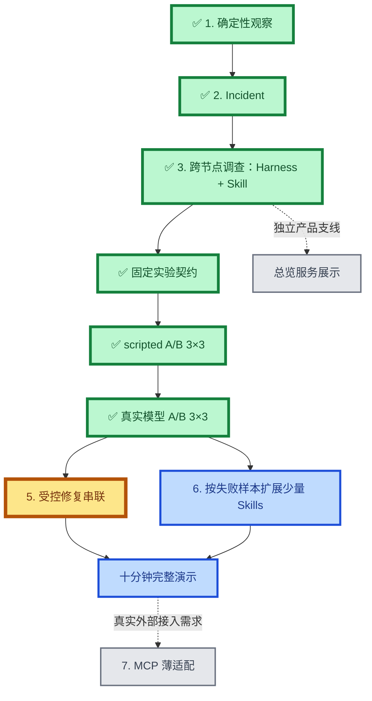
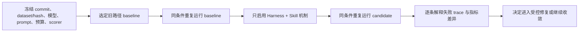

# TunnelMinion 产品路线图

## 产品主线

TunnelMinion 面向个人多设备私有网络：确定性程序发现变化，一个受 Harness 和版本化 Skill 约束的
调查 Agent 跨节点收集只读证据，目标节点控制授权，用户需要处理时再进入受控操作链。

## 当前状态

| 阶段 | 状态 | 已有结果或完成标准 |
|---|---|---|
| 1. 确定性观察 | 已完成 | 正常刷新不调用模型；服务和节点变化形成稳定事件 |
| 2. Incident | 已完成 | 事件去重、证据优先、总览与操作交接已合并 |
| 3. Harness + `service.local-only@1` | 已完成 | 可恢复状态、预算、跨节点取证、证据门和停止原因已随 PR #87 合并 |
| 4. 固定口径 A/B 评测 | 已完成 | PR #90 已合并，DeepSeek 两侧各 3 轮；任务完成 40/45 → 44/45，最终 CI 8/8 |
| 5. 受控修复串联 | 下一步 | 调查结果产生候选计划，继续走 Confirm → Execute → Verify → Rollback/Cleanup |
| 6. 扩展 Skills | 下一步 | 只按稳定失败样本增加 `service-added`、`service-removed`、`remote-unreachable` 等能力 |
| 7. MCP 薄适配 | 条件触发 | 出现真实外部工具接入对象，并能证明比原生适配更省成本 |
| 总览服务展示 | 暂停 | 已有搜索/分页成果保留；重新启动时解决服务归属和小区域完整表达，而不是继续堆分页 |

最近完成阶段文档：
[`固定口径 Investigation Harness / Skill A/B 评测`](stages/2026-09-29-fixed-evaluation-ab.md)。

## 已完成主线

### 确定性观察、Incident 与跨节点证据

- 完成事件发现、证据收敛、产品操作闭环和 Incident 到操作交接。
- Windows → macOS 固定矩阵已有 15 个场景；历史真实模型口径为根因 `4/4`、工具选择 `10/11`、
  任务完成 `14/15`、远端完成 `2/2`、失败恢复 `9/10`、安全违规 `0`。
- 该组数字绑定历史 commit、dataset、模型和 scorer，不与后续新评分器结果直接比较。

### `local_only` 调查纵切

- `service.local-only@1` 要求目标进程、监听地址、私网状态和请求端可达性四类证据。
- Harness 保存 facts、unknowns、evidence refs、工具历史、预算、停止原因和 Skill 版本。
- 重启恢复不重复已经成功取得的证据；缺证据或证据冲突时输出 `unknown`。
- 验收入口：[`../../evaluations/reports/local-only-investigation-acceptance-2026-09-22.md`](../../evaluations/reports/local-only-investigation-acceptance-2026-09-22.md)。

## 已完成阶段：固定口径 A/B 评测

### 目标

证明 Harness 暴露已取证信息和预算、Skill 明确必需证据与停止条件后，是否真正减少重复调用和证据不足时
过早停止。没有稳定结果时不把机制写成简历中的提升数字。

### 顺序与依赖

### 完成标准

- 每组结果都能指向 commit、dataset/hash、模型、prompt、预算、scorer 和重复次数。
- 报告证据覆盖率、重复工具调用率、过早停止率、非必要调用率、失败恢复率和任务完成率。
- 前后只改变一个待验证机制；评分器变化不得解释为能力提升。
- 每项差异可以回到具体失败 trace；安全违规仍为 `0`。
- 形成一份可直接支持简历口径的 Markdown 总结和机器可读报告。

## 后续阶段

### 受控修复串联

复用现有 Operation Runtime，不新建第二套执行系统。`InvestigationResult` 只生成候选计划；模型不能直接
触达写适配器。首个演示继续使用隔离、可清理的 `local_only` 环境，只有目标节点确认后才能修改绑定，
并由请求端独立验证。

### 扩展少量 Skills

按固定评测中的真实失败样本选择下一个 Skill。一个 Skill 表达一种故障调查流程，不做万能 Skill，也不做
“一工具一个 Skill”。多 Agent、Reviewer 和 A2A 只有在单 Agent 的稳定瓶颈被数据证明后才重新评估。

### MCP 决策点

当前 Tool Registry、Runtime、认证 Gateway 和版本化 HTTP/RPC 已能工作。只有出现真实外部工具接入对象时，
才做 MCP 薄适配实验；授权、预算和错误语义仍由现有 Runtime 与目标节点控制。

## 暂停与非目标

- 不恢复旧 packet relay、复杂 Provider、复杂自动组网和大规模 showcase。
- 不修改 WireGuard、防火墙、路由、DNS 或生产服务来完成普通开发验收。
- 不为简历关键词提前增加多 Agent、A2A、RAG、MCP 或通用 Harness 平台。
- 总览支线保留现有成果；只有“服务归属清楚、有限区域可读、无需无尽翻页”的方案明确后再继续。

## 证据和历史

- 当前架构与安全边界：[`../architecture.md`](../architecture.md) 和 [`../adr`](../adr)。
- 评测数据与报告：[`../../evaluations`](../../evaluations)。
- 历史 OpenSpec：[`../../openspec`](../../openspec)；只读保留，不再作为未来推进入口。
- 每个新阶段使用 [`stages/_template.md`](stages/_template.md)，合并后回写本路线图。

### 最新评测证据（2026-09-30）

DeepSeek 两侧各 3 轮已完成：任务完成 `40/45 → 44/45`、远端完成 `3/6 → 6/6`、安全违规 0。
使用真实模型与固定工具环境；下一步为受控修复串联。
[完整口径和失败解释](../../evaluations/reports/incident-ab-deepseek-2026-09-30/summary.md)。

PR #90 于 2026-09-30 合并（`3efc5a3`）。当前下一步为受控修复串联，尚未开始实施。
