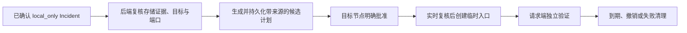

# Incident 到受控临时恢复访问串联

- 状态：`进行中（实现与本地门禁完成，等待 PR 审查）`
- 主写分支：`feature/incident-repair-chain`
- 阶段起点：`21d3bfddbdf39db69014537e361448710dd19611`
- 对应总流程：`5. 受控修复串联`

## 结果与用户影响

用户可以从证据充分的 `local_only` Incident 发起临时 HTTP 共享请求，并在操作详情中看到真实状态、
返回来源 Incident。来源只负责限定“为什么发起”；目标节点仍需明确批准，执行前仍会实时重新取证，
请求端仍需独立验证。

该能力是临时恢复访问的缓解手段，不会修改原服务的监听配置，也不代表故障已根治。

## 当前证据与缺口

- 已有：Incident 已保存目标节点、服务身份、端口、Harness 步骤、证据引用、结论和停止原因。
- 已有：Operation Runtime 已实现 L2 临时共享、目标端授权、执行前服务指纹复核、请求端验证和清理。
- 已有：总览已把 Incident ID、目标节点和端口带到操作页，但原先只是浏览器预填。
- 缺口：原路径未从后端 Incident 存储复核来源，也未把来源持久绑定到 Operation。

## 范围

- 本阶段完成：后端复核已确认的 `local_only` Incident、完整 Skill 证据、当前快照、目标和端口；把来源
  写入现有 `OperationPlan`；在详情页展示并链接来源；保留手动发起路径；复用现有授权、执行、验证和
  清理测试形成隔离纵切证据。
- 本阶段不做：任意配置修改适配器、修改原服务绑定、WireGuard/防火墙/路由/DNS 变更、真实私网共享、
  第二套执行系统、新依赖或通用修复框架。

## 依赖与顺序

## 完成标准

- [x] 证据充分且目标、服务、端口匹配时可生成带来源的候选计划。
- [x] 来源不存在、证据不足或目标/端口不匹配时，在诊断和远端写请求前拒绝。
- [x] 来源关联随请求端和目标端现有 Operation JSON 聚合持久化，详情可查询并返回 Incident。
- [x] 手动发起操作不带来源时继续使用原流程。
- [x] 正常授权、执行、请求端验证、到期/撤销，以及未授权、验证失败和清理失败路径可隔离复现。
- [x] 定向测试、格式、类型、前端全量测试与构建通过。
- [ ] PR 合并后回写最终合并提交，并把路线图节点标为已完成。

## 实施记录

- 来源字段直接复用 `OperationPlan` 和现有 SQLite JSON 聚合，无新表、迁移或依赖。
- 来源操作的幂等键包含 Incident ID，避免与参数相同的手动操作混为同一来源。
- 后端只接受存储中状态为 `confirmed`、停止原因是 `evidence_sufficient`、`service.local-only@1`
  必需步骤全部成功，且当前快照仍是新鲜 HTTP(S) 回环监听的 Incident。
- Incident 结论不替代候选计划实时诊断、目标节点授权、执行前指纹复核或请求端验证。
- 固定 OpenAPI 基线因新增请求/详情字段按实际 schema 更新；未改依赖锁。

## 完成结果

- 实现提交：`c546b22`。
- 边界与基线测试提交：`2d3a8bf`；格式补充：`628ed9d`。
- 隔离验证报告：
  [`../../../evaluations/reports/incident-repair-chain-2026-09-30.md`](../../../evaluations/reports/incident-repair-chain-2026-09-30.md)。
- 遗留限制：当前只支持既有 `share_local_http_service` 临时缓解；真实双机部署验证不在本阶段执行。
