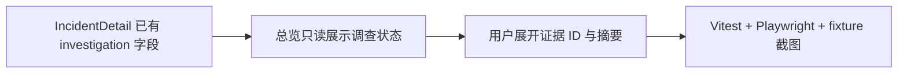

# 调查证据可视化

- 状态：`进行中`
- 主写分支：`feature/investigation-evidence-view`
- 基线：`48e7db33c01b2d3c765ba4dd0f4b74c954dc6a97`
- 对应总流程：`跨节点调查：Harness + Skill`

## 结果与用户影响

总览的调查详情将直接展示已经保存的 Agent 调查状态：使用哪个 Skill、当前走到哪一步、调用过哪些工具、在哪个节点执行，以及证据引用和仍未知事项。用户可以看懂调查怎样推进和停止，不需要从网络运维字段里猜 Agent 是否真正参与。

## 当前证据与缺口

- 已有：Incident API 已返回 `investigation-state/v1`，前端 schema 已校验全部结构化字段。
- 已有：总览已经能读取详情并展示结论、公开轨迹和未知项。
- 缺口：页面尚未展示结构化步骤、执行节点、次数和公开证据引用；用户看不出 Skill 与 Harness 的作用。

## 范围

- 本阶段完成：只读展示结构化调查状态；保留无结构化状态事件的 report/trace；补相称的 Vitest、Playwright 和 fixture 截图；更新用户指南。
- 本阶段不做：不改 API、状态机和工具协议；不恢复服务长列表与分页；不新增 CLI、路由、依赖或观测平台；不展示任意 `observations` 或模型内部过程。

## 依赖与顺序

## 完成标准

- [x] 运行中、成功、失败、待确认和待执行步骤可读。
- [x] 缺少结构化状态时保留已有 report/trace，不虚构次数或完成状态。
- [x] 证据 ID 与摘要默认收起、可以展开，页面不输出整份 `observations`。
- [x] 打开详情只发 GET，不增加轮询或模型调用。
- [x] 前端全量格式、类型、测试、构建和体积门禁通过。
- [x] fixture 浏览器截图可复核并明确不是实机证据。
- [ ] Pull Request 创建并等待复核，不自行合并。

## 实施记录

复用现有 `IncidentDetail` 类型和原生 `
`，没有增加依赖。页面只解释“按 Skill 调用允许工具并记录公开证据”；模型选择、程序执行和停止控制的详细职责放在[用户指南](../../guide/agent-investigation.md)。工具成功只按原状态展示，不换算为诊断正确率或证据覆盖率。

Playwright fixture 中的两条成功步骤只用于验证文本、展开和布局，不构成 `service.local-only` 四类必需证据已经充分的业务验收，也不是真实模型或真机结果。

## 完成结果

实现与本地验证已完成，等待 Pull Request 复核，尚未合并：

- Vitest：`16` 个文件、`110` 项测试通过。
- Playwright：incident 定向用例在 Chromium 与 WebKit 共 `4` 项通过；断言详情请求仅为 GET、打开详情不产生写请求，并展开核对公开证据。
- `npm run build` 通过，其中包含 TypeScript 类型检查；`npm run format:check` 通过。
- 体积门禁通过：初始 JS + CSS gzip 为 `150.81 KiB`，低于 `300.00 KiB` 上限和基线加 10% 的 `155.75 KiB`。
- 浏览器截图由 Playwright fixture 写入本地 `frontend/test-results`，不提交跨平台像素基线，也不作为真机或四类证据充分性的证明。
