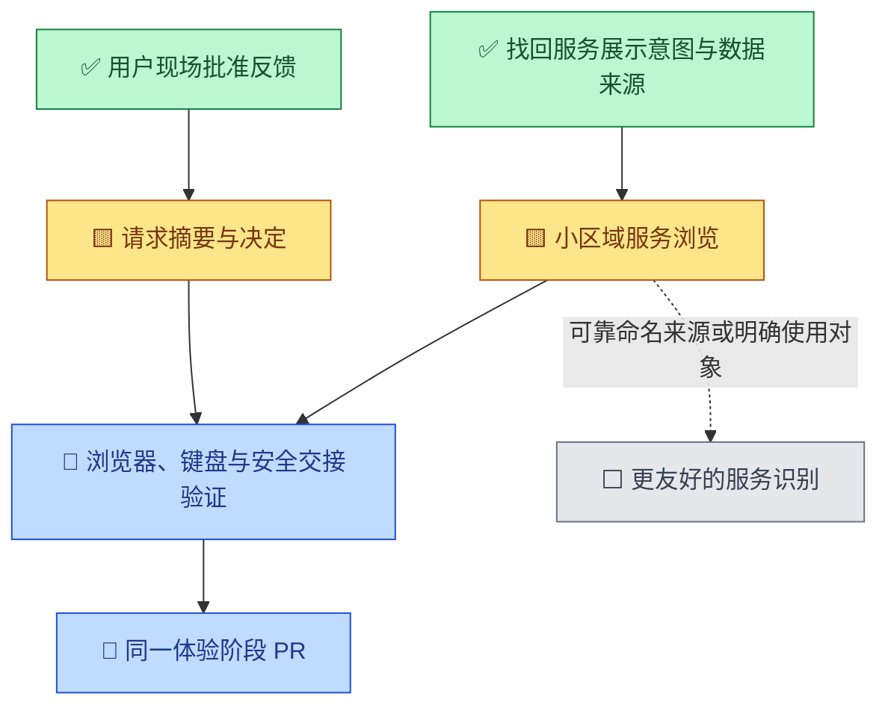

# 普通用户优先的批准与服务浏览

- 状态：`进行中`
- 主写分支：`feature/plain-language-experience`
- 基线：`f171b2c97d41bd5435a56f4216533fef6e246e42`
- 对应总流程：`前端日常使用体验`

## 结果与用户影响

用户现场反馈批准请求信息过多、术语过重，服务列表无法识别且过长。本阶段先收敛两条高频路径：看懂请求
并决定是否批准；在小区域了解设备服务，不被后台监听清单淹没。不是全产品重写，也不宣称已通过老人实测。

## 当前证据与缺口

- 用户历史意图是“一小块区域完整展示有哪些服务”，否定用分页掩盖长列表。
- PR #102 已按设备折叠，但展开仍逐条罗列全部监听项；13 项浏览器样例截图高约 1760px。
- 当前本机采集把实际监听和容器证据合成服务摘要，按节点、协议、地址、端口去重；总览合并本机、目录
  缓存和明确配置的对端观察。没有按用户用途筛选，本机/目录摘要通常没有服务显示名。
- 批准详情首屏直接呈现服务编号、指纹、节点编号、验证方法、授权依据、资源与状态历史；动作位于其后。
- 名称必须来自已有设备/服务记录，失效或缺失时明确未知。不按端口、进程名猜“照片备份”等用途。

## 范围

- 本阶段完成：请求对象、访问者、时长和风险优先；技术细节收起；确认弹窗采用相同摘要；批准有效期和
  实际访问时长分别解释；设备展开后先列有名称的服务，无名称项目用计数表达；完整技术清单可搜索且限高。
- 本阶段不做：不新增命名推断或自动筛选规则，不改采集和授权协议，不重做设置/记忆/聊天，不新增依赖，
  不部署到真机、不调用收费调查、不修改网络或生产进程。技术事实、异常和未知不丢弃。

## 依赖与顺序

## 完成标准

- [x] 不展开技术详情就能读到请求对象、访问者是否可识别、风险、实际访问时长和可用动作。
- [x] 名称缺失/陈旧时保持未知，不将设备显示名当作人的身份认证。
- [x] 批准与执行原有服务端复读、一次提交、未知结果禁止重放、取消焦点回归测试通过。
- [x] 数百项目不使服务区域无限长；搜索能找到最后一项，无结果/未知/异常可辨认。
- [ ] 320px、桌面、缩放、键盘、可访问性与正式包路径通过；本地浏览器已通过，正式包待 CI。
- [ ] PR 合并，路线图与本页结果回写。

## 实施记录

复用已有 React、原生 details、设备和服务契约，不引入新的前端框架。详情额外读取既有总览 GET，仅用于
匹配相同节点/服务 ID 的新鲜显示名；失败时退回未知，不影响服务端授权。风险与人工处理要求始终保留在
日常视图中，原始技术记录可展开。命名缺口不是通过更多徽标、分页或文案能够彻底解决的。

## 完成结果

本地最终前端组件测试 111 项通过，Chromium/WebKit 全量浏览器 48 项通过；类型、生产构建、格式、
体积预算与供应链脚本 5 项通过。初次浏览器执行的两项失败分别为旧文案断言、技术折叠隐藏访问失效原因；
后者补回日常视图的直白提示，保留原始错误码，最终全量回归通过，不通过放松测试掩盖真实问题。

截图由 `plain-language-experience.spec.ts` 和 `operation-detail.spec.ts` 生成，保存在自有工作树
`frontend/test-results/`：包含三百后台项目的摘要、访问者名称匹配、320px/桌面/缩放批准页与确认框。
全部为本机隔离页面与受控样例，不是重新进行真机恢复，也不是老人用户实测。未部署到 Mac 的既有页面。

这版解决阅读顺序和列表长度，但本机/目录服务名称来源仍欠缺；没有名字时不会把所有后台程序包装成
“可用产品服务”。全前端词汇与交互一致性尚未在此阶段完成。CI、PR 与最终合并结果待补。
