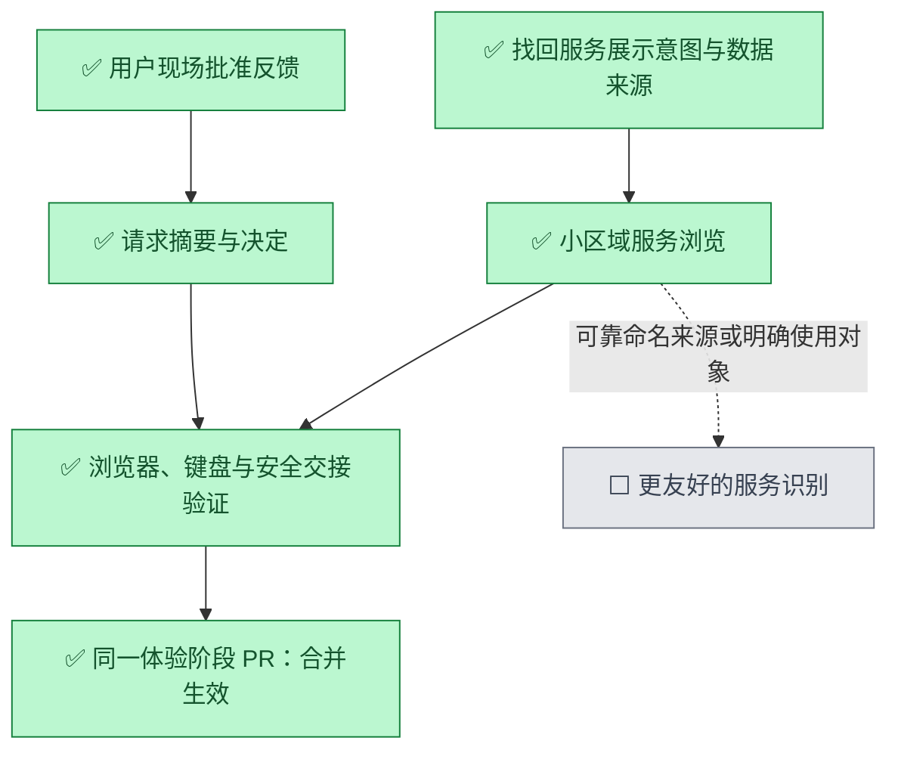

# 普通用户优先的批准与服务浏览

- 状态：`已完成`，PR #106 已合并为 `7ad00f8`；首页收拢修正见本页补充记录。
- 主写分支：`feature/plain-language-experience`
- 基线：`f171b2c97d41bd5435a56f4216533fef6e246e42`
- 对应总流程：`前端日常使用体验`

## 结果与用户影响

用户现场反馈批准请求信息过多、术语过重，服务列表无法识别且过长。本阶段先收敛两条高频路径：看懂请求
并决定是否批准；在小区域了解设备服务，不被后台监听清单淹没。不是全产品重写，也不宣称已通过老人实测。

## 当前证据与缺口

- 用户历史意图是“一小块区域完整展示有哪些服务”，否定用分页掩盖长列表。
- PR #102 已按设备折叠，但展开仍逐条罗列全部监听项；13 项浏览器样例截图高约 1760px。
- 当前本机采集把实际监听和容器证据合成服务摘要，按节点、协议、地址、端口去重；总览合并本机、目录
  缓存和明确配置的对端观察。没有按用户用途筛选，本机/目录摘要通常没有服务显示名。
- 批准详情首屏直接呈现服务编号、指纹、节点编号、验证方法、授权依据、资源与状态历史；动作位于其后。
- 名称必须来自已有设备/服务记录，失效或缺失时明确未知。不按端口、进程名猜“照片备份”等用途。

## 范围

- 本阶段完成：请求对象、访问者、时长和风险优先；技术细节收起；确认弹窗采用相同摘要；批准有效期和
  实际访问时长分别解释；设备展开后先列有名称的服务，无名称项目用计数表达；完整技术清单可搜索且限高。
- 本阶段不做：不新增命名推断或自动筛选规则，不改采集和授权协议，不重做设置/记忆/聊天，不新增依赖，
  不部署到真机、不调用收费调查、不修改网络或生产进程。技术事实、异常和未知不丢弃。

## 依赖与顺序

## 完成标准

- [x] 不展开技术详情就能读到请求对象、访问者是否可识别、风险、实际访问时长和可用动作。
- [x] 名称缺失/陈旧时保持未知，不将设备显示名当作人的身份认证。
- [x] 批准与执行原有服务端复读、一次提交、未知结果禁止重放、取消焦点回归测试通过。
- [x] 数百项目不使服务区域无限长；搜索能找到最后一项，无结果/未知/异常可辨认。
- [x] 320px、桌面、缩放、键盘、可访问性通过；两端正式包已通过首轮 CI，最终版本由最新 CI 验证。
- [x] 路线图与本页完成记录已准备；此完成项仅在 PR #106 最新 CI 通过并合并后生效。

## 实施记录

复用已有 React、原生 details、设备和服务契约，不引入新的前端框架。详情额外读取既有总览 GET，仅用于
匹配相同节点/服务 ID 的新鲜显示名；失败时退回未知，不影响服务端授权。风险与人工处理要求始终保留在
日常视图中，原始技术记录可展开。命名缺口不是通过更多徽标、分页或文案能够彻底解决的。

## 完成结果

本地最终前端组件测试 111 项通过，Chromium/WebKit 全量浏览器 48 项通过；类型、生产构建、格式、
体积预算与供应链脚本 5 项通过。初次浏览器执行的两项失败分别为旧文案断言、技术折叠隐藏访问失效原因；
后者补回日常视图的直白提示，保留原始错误码，最终全量回归通过，不通过放松测试掩盖真实问题。

截图由 `plain-language-experience.spec.ts` 和 `operation-detail.spec.ts` 生成，保存在自有工作树
`frontend/test-results/`：包含三百后台项目的摘要、访问者名称匹配、320px/桌面/缩放批准页与确认框。
全部为本机隔离页面与受控样例，不是重新进行真机恢复，也不是老人用户实测。未部署到 Mac 的既有页面。

这版解决阅读顺序和列表长度，但本机/目录服务名称来源仍欠缺；没有名字时不会把所有后台程序包装成
“可用产品服务”。全前端词汇与交互一致性尚未在此阶段完成。

[PR #106](https://github.com/Sugarfarmeriod/TunnelMinion/pull/106) 保存实现、回归和本记录。
首轮 `e812220` 的 [CI](https://github.com/Sugarfarmeriod/TunnelMinion/actions/runs/37221250969) 8/8 通过，
包含两端正式包与一致性检查。随后为无效批准时间补原生输入校验展开行为，Chromium/WebKit 定向
4 项通过；最终发布以 [PR 最新检查](https://github.com/Sugarfarmeriod/TunnelMinion/pull/106/checks)
通过并合并为准，不把旧提交的通过冒充最终门禁。验证进程使用临时目录，由浏览器测试退出时自动清理。

## 首页收拢修正（2026-10-05）

用户看到截图后再次指出“不要分这么多栏目”。本次作为原体验阶段的小修正，不新建产品支线：
首页只保留设备与服务一个主体，成功读取且没有待处理请求时不显示空待办；真实批准、执行、未知结果和
清理失败仍提供处理入口。调查、运行状态和数据来源统一收在“更多信息”，有效调查深链接自动展开。

日常视图去掉重复计数、原始地址和设备证据时间；完整技术清单、逐设备来源及陈旧/未知/不可用信息仍可
查看。服务显示“已发现，访问待确认”，不把监听记录解释为端到端可用；没有可靠服务名称时仍明确未知。
本次不重做顶部五个入口，不更改采集、授权或生产环境，仍不是老人实测或 Mac 部署。

修正分支为 `fix/overview-section-overload`，基线 `7ad00f8`。首笔 `246005b` 已验证组件 111 项、
Chromium/WebKit 全量 48 项、构建、格式和体积预算；后续阅读层级修整以
[PR #107 的最终检查](https://github.com/Sugarfarmeriod/TunnelMinion/pull/107/checks) 与合并状态为准。
浏览器截图由 `overview-product-experience.spec.ts` 与 `plain-language-experience.spec.ts` 生成，
分别覆盖两设备首页和三百项目展开摘要；均是明确命名的隔离样例，异常与陈旧情形由降级矩阵独立覆盖。

本轮发现 WebKit 测试打开临时访问新窗口后没有返回原窗口，拒绝原因在填充后仍为空，未产生拒绝请求。
结束访问后关闭自有测试窗口，并增加提交前输入值断言，原拒绝和一次提交断言继续保留；定向与全量通过。
没有修改产品批准逻辑，也没有增加固定等待或重试来掩盖问题。

2026-10-08 恢复推进后补齐正式包的请求入口检查：仍验证同一待批准请求和同一操作详情链接，只把旧栏目
定位改为新请求列表；陈旧记录检查限定在设备区域，避免把技术来源里的同名文本误当成可点击设备。
最新本地组件 111 项、Chromium/WebKit 全量 48 项通过，类型、生产构建、格式和体积预算通过。
最终跨平台正式包与完整 CI 结果仍绑定 PR #107 最新提交，不使用首笔提交的通过或失败冒充最终结果。

恢复后的 CI 发现间接开发依赖 `source-map-js@1.2.1` 命中
[安全公告 GHSA-68fv-2mgg-jv7q](https://github.com/advisories/GHSA-68fv-2mgg-jv7q)，因此阻止运行包构建。
仅将锁文件中的该依赖更新至修复版 `1.2.2`，不修改直接依赖、产品代码或安全门禁；供应链检查和
最终运行包验证使用更新后的锁文件，不豁免漏洞。

Python 测试及两端正式包随后通过，但 Python 供应链扫描命中已有间接依赖 `langgraph-sdk@0.4.2`
的[授权装饰器安全公告 GHSA-fvww-7h3r-vfhp](https://github.com/advisories/GHSA-fvww-7h3r-vfhp)。
仅将 `uv.lock` 中该依赖更新至修复版 `0.4.4`，不新增 LangGraph 功能，也不把间接依赖存在当作
本项目调查循环使用 LangGraph 的证据。发布仍要求最新锁文件通过原有完整门禁。
