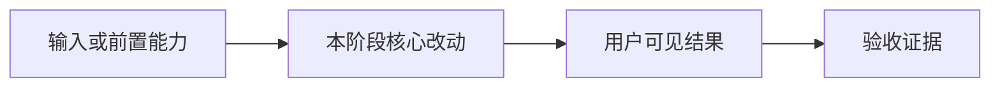

# <阶段名称>

- 状态：`下一步`
- 主写分支：`<type/topic>`
- 基线：`<commit>`
- 对应总流程：`<路线图节点>`

## 结果与用户影响

用两三句话说明完成后用户能做什么，以及当前为什么值得做。

## 当前证据与缺口

- 已有：
- 缺口：

## 范围

- 本阶段完成：
- 本阶段不做：

## 依赖与顺序

## 完成标准

- [ ] 用户可见主路径可重复运行。
- [ ] 失败和边界路径有明确结果。
- [ ] 定向验证与必要门禁通过。
- [ ] 指标、报告或截图可追溯到 commit 和运行条件。
- [ ] PR 合并，路线图与本页结果已回写。

## 实施记录

只记录影响范围、关键取舍和偏离原计划的原因，不写逐命令流水账。

## 完成结果

阶段结束时填写 PR、合并提交、验证结果、证据路径和遗留限制。
