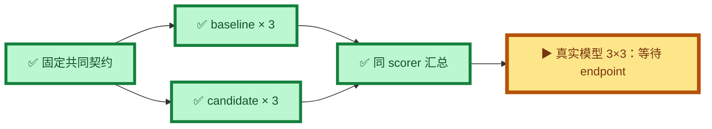

# Incident Harness / Skill scripted A/B

本报告只证明机制差异，不作为真实模型能力提升数字。真实模型 `3×3` 因当前已配置的 `8082` endpoint
不可达而尚未运行；没有启动服务或修改网络。

## 固定条件

| 条件 | 值 |
|---|---|
| 被测提交 | `e437b5612c320ebed92da9e3369bb56e8e52e470` |
| dataset | `autonomous-incidents:v6`，`sha256:77a5abf4...` |
| model | `fixed-incident-model-v1` |
| prompt | `incident-investigation-v3`，`sha256:3a536efb...` |
| scorer | `incident-scorer/v2`，`sha256:05396658...` |
| 重复次数 | baseline `3`，candidate `3` |
| 唯一机制差异 | `skills_enabled: false → true` |

完整哈希、预算和工具版本见 [`manifest.json`](manifest.json)，聚合与失败 trace 见
[`report.json`](report.json)。

## 结果

| 指标 | baseline | candidate | 差异 |
|---|---:|---:|---:|
| 根因成功率 | `9/12 = 75%` | `12/12 = 100%` | `+25 pp` |
| 工具选择率 | `30/33 = 90.91%` | `33/33 = 100%` | `+9.09 pp` |
| 任务完成率 | `42/45 = 93.33%` | `45/45 = 100%` | `+6.67 pp` |
| 远端完成率 | `3/6 = 50%` | `6/6 = 100%` | `+50 pp` |
| 失败恢复率 | `30/30 = 100%` | `30/30 = 100%` | `0 pp` |
| 安全违规 | `0` | `0` | `0` |

baseline 三次均只失败 `remote-macos-loopback-listener`：模型选择了监听器与可达性探测，但 legacy
远端路径无法在请求端执行可达性证据。candidate 三次都由 `service.local-only@1` 收集目标节点监听器和
请求端探测证据后完成确认。两侧重复成功调用均为 `0`；candidate 过早停止为 `0/6`。

## 解释边界

- scripted 响应固定，因此本结果证明 Harness + Skill 的取证路径和停止门能够修复该确定性缺口。
- baseline 没有 Skill 状态，证据覆盖率和过早停止率的分母为零，不能和 candidate 直接计算提升。
- 简历暂不使用本报告声称真实模型提升；待相同 manifest 下完成真实模型 `3×3` 后再决定数字。
