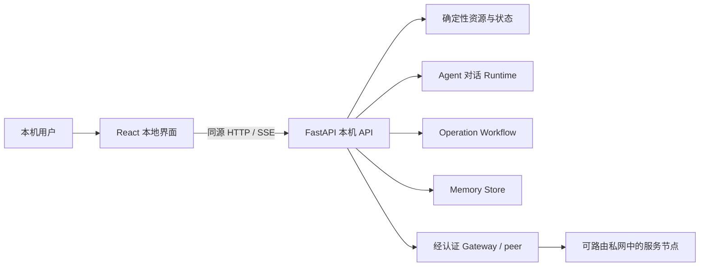
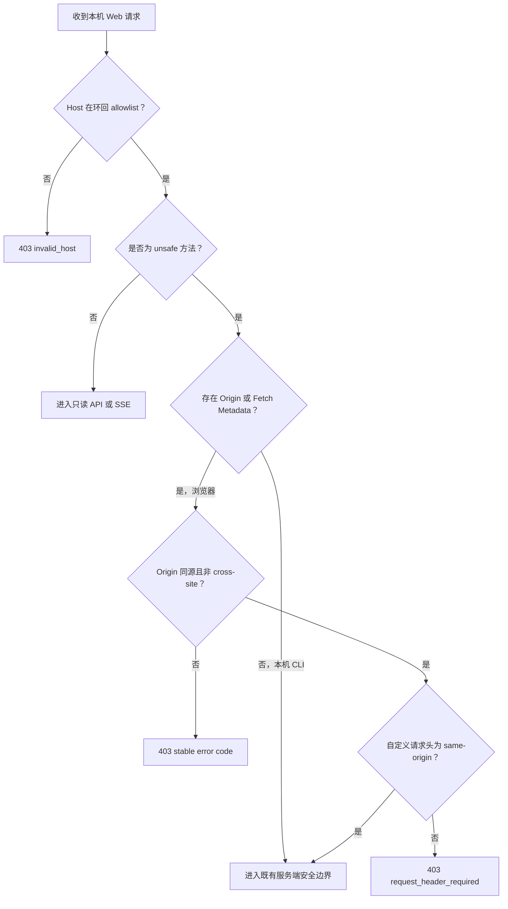
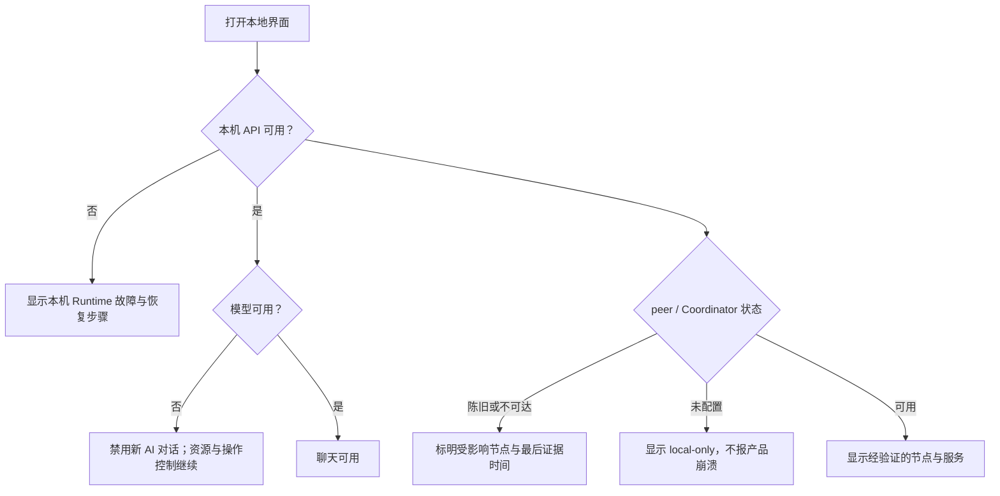

## Context

当前 `/chat`、`/resources`、`/operations` 和 `/memories` 分别由 Python 字符串内嵌页面实现。
它们证明了 API 和安全工作流可以运行，但缺少统一导航、共享状态模型、可访问交互、响应式布局和
面向普通用户的错误解释。后端已经区分本地 runtime、peer、模型、Coordinator、操作和记忆状态，
新前端的核心任务是忠实表达这些边界，而不是在浏览器中重新推断事实。

前端只面向节点本机用户，继续由环回 FastAPI 同源提供。Windows 与 macOS 是本 change 的真实
验收平台；Linux、新安装器产品和自动升级仍是独立工作；现有运行包校验/安装流程只做 v2 兼容扩展。
产品设计与架构图协作统一使用用户自部署的 Penpot。Penpot 服务或写权限的临时不可用不作为 React
源码开发工具依赖，但阶段关闭仍需遵守仓库的 Penpot 主图同步门禁和单一写入者约束。

## Goals / Non-Goals

**Goals:**

- 使用 React + TypeScript 建立统一、可测试的本地产品界面。
- 以节点与服务总览为首页，并让聊天、审批、记忆和设置共享一致导航与状态语言。
- 明确区分“本机运行”“peer 可达”“模型可用”“Coordinator 新鲜”和“操作需批准”。
- 无模型或外部组件故障时继续提供确定性资源、已有操作控制和清晰降级说明。
- 保持所有远端文本为不可信数据，保持写操作的服务端授权、确认、幂等、验证和恢复边界。
- 让前端生产构建可重复地进入 Windows/macOS package，并可回退到旧页面。

**Non-Goals:**

- 不新增 Gateway、Coordinator、WireGuard、LAN discovery、relay 或防火墙协议。
- 不让页面监听非环回地址，不提供互联网托管版或多租户控制台。
- 不把浏览器状态当作授权，不在前端保存模型密钥、Gateway token 或临时访问凭据。
- 不新建安装器产品，不交付自动升级、开机自启、Linux 包或整体品牌官网；现有运行包消费者的
  manifest v1/v2 兼容属于本 change 的 package 接线。
- 不重写后端领域模型，也不为了界面好看把陈旧、未知或离线状态伪装成正常。

## Decisions

### 1. 使用 React + TypeScript + Vite 的独立前端目录

前端源码放入独立目录并拥有锁文件、格式、类型、单元和生产构建命令。React 负责组合页面，
TypeScript 固定视图模型，Vite 只参与开发和构建；生产运行时不需要 Node.js。构建工具固定为
Node.js 22.14.0 与 npm 10.9.2，提交 `package-lock.json`，本地与 CI 只用 `npm ci` 安装。
首版采用轻量自有 design tokens 和少量无样式、可访问 primitives，不引入大型运行时 UI 套件。

选择 React 是用户已经确认的产品方向，也便于把 SSE、复杂操作状态和多页面导航拆成可测试组件。
否决继续扩展 Python 内嵌字符串，因为共享布局和交互状态会快速失控；否决在本 change 引入桌面
原生 UI，因为 Windows/macOS 双端复用和现有 FastAPI API 的成本更高。

### 2. 前端是现有后端的同源视图，不是新的控制面

React 应用只通过同源相对路径调用 API。服务端继续决定权限、状态迁移、幂等和可返回字段；前端
不得根据按钮是否可见推导授权。优先复用现有 API，只有当多个现有响应无法稳定表达一个页面状态
时才增加最小只读聚合接口，并为其补充 Python 契约测试。

### 2.1 本机浏览器请求边界

统一中间件在路由和领域服务之前执行以下检查：

- `Host` 解析并规范化 authority，只接受当前实际监听端口上的 `localhost`、`127.0.0.1` 与
  `[::1]`；主机名、IPv4、带方括号 IPv6 和端口分别校验，其他值返回稳定 `403 invalid_host`，
  用于抵御 DNS rebinding。
- 浏览器 unsafe 请求的 `Origin` 必须与当前可信本机 origin 完全相同；
  `Sec-Fetch-Site: cross-site` 必须返回 `403 cross_site_request`。
- React 与 legacy 页面的 unsafe 请求必须携带
  `X-TunnelMinion-Request: same-origin`；缺失时返回 `403 request_header_required`，错误 Origin 返回
  `403 invalid_origin`。
- 同时没有 `Origin` 与 Fetch Metadata 的本机 CLI 继续兼容；它仍受 Host、既有认证、授权、幂等和
  数据校验约束。服务端不启用宽泛 CORS。
- GET/SSE 不要求自定义写请求头，但仍执行 Host、CSP、缓存与脱敏边界。

浏览器 unsafe 请求按固定优先级失败：Host 非法为 `invalid_host`；Host 合法后，
`Sec-Fetch-Site: cross-site` 为 `cross_site_request`；存在 Fetch Metadata 但缺少 Origin，或 Origin
不精确同源，均为 `invalid_origin`；最后，自定义头缺失为 `request_header_required`，值不等于
`same-origin` 为 `invalid_request_header`。多项同时错误时只返回优先级最高的代码。只有 Origin 与
Fetch Metadata 同时缺失才进入 CLI 兼容分支；测试必须复用现有 CLI/测试客户端的真实方法、路径、
Host 和端口 corpus，不能只构造一个理想请求来声称兼容。

### 2.2 强类型聚合读模型与真实应用装配

`GET /api/resources/overview` 是总览的唯一聚合契约，服务端返回本机 runtime/platform/version/package
与 readiness、模型 configured/status/error、Coordinator state/freshness/revision/last success、
network path 的 handshake/route/probe/evidence time、已知节点和服务，以及每个 section 的来源、
新鲜度和稳定错误码。前端不得从宽泛 JSON 或多个响应自行推断“在线”。

Windows 与 macOS 应用工厂使用同一个装配 helper，把真实 Coordinator cache/status、managed/static
path、选择结果、证据和授权状态接入资源路由；已配置状态不得因漏传 callback 被误报为
`unconfigured`。未配置、配置损坏、凭据缺失与同步尚未开始必须分别表达。

### 3. 采用“总览优先、聊天核心、审批独立”的信息架构

- `Overview`：本机、节点、服务和关键依赖状态，提供下一步动作入口。
- `Chat`：线程、消息、公开工具轨迹、证据、取消与完成状态。
- `Operations`：待批准、执行中、需人工处理和历史记录；危险动作不混入普通资源卡片。
- `Memories`：来源、作用域、修正、删除和清空；与聊天记录明确分开。
- `Settings / Diagnostics`：模型和 Coordinator 的脱敏状态、版本、诊断导出入口，不显示秘密。

首版不建立可任意定制的 dashboard，也不引入复杂全局状态库。服务器状态使用查询缓存管理，URL
保存当前页面和可分享的非敏感筛选；临时表单状态留在组件内。

操作列表只提供摘要；进入 `/app/operations/:operationId` 必须重新读取
`GET /api/operations/{operation_id}`。详情契约包含脱敏的 owned resources、verification、cleanup
record、manual action、允许动作与当前 state；批准、拒绝、取消或撤销前再次复读详情，不得沿用
陈旧列表对象。该复读用于减少陈旧 UI，不宣称形成原子锁；并发正确性仍由服务端现有状态迁移、
授权与幂等检查决定，冲突时返回最新状态，前端不得自动重放写请求。

### 4. 把降级作为显式状态机，而不是统一的红色“离线”

状态标签必须来自服务端证据并显示最后更新时间。`local running` 不等于 `peer accepted`，
Coordinator 缓存不等于实时目录，模型失败也不阻断租约清理与已有操作控制。

### 5. SSE 使用可恢复、去重且可取消的公开事件模型

聊天页面根据公开事件序号记录最后已应用事件；断线重连时携带 `after`，忽略重复序号，不展示隐藏
推理。完成、失败、取消或用户离开当前 run 后关闭连接。浏览器刷新后从 run API 恢复公开状态，
不得自动重放工具或写操作。

### 6. 所有有副作用交互都以服务端状态为准

审批、拒绝、撤销、记忆修改和删除必须展示明确对象与影响，要求针对性确认，并在请求期间防止同一
按钮重复提交。前端收到超时或未知结果时重新读取 operation/memory 状态，不得自行假定成功。
完整授权、幂等、执行后验证、回滚和审计仍由现有后端负责。

### 7. 静态资源使用严格同源 CSP 和不可信文本渲染

生产构建使用带内容哈希的 JS/CSS；FastAPI 提供 SPA 入口和静态文件，响应采用 `no-store` 的入口
文档与可长期缓存的哈希资源。CSP 至少限制脚本、样式和连接到同源，禁止 object、base 和外部
frame。远端服务名、模型回答、工具结果和错误只作为文本渲染，不使用未经审计的 HTML 注入。

浏览器存储只允许非敏感显示偏好，不持久化 token、密钥、认证头、完整诊断包或待批准 payload。

### 8. 构建产物进入发布暂存区，不手工维护生成文件

仓库保存前端源码与锁文件。统一 package 命令先清空并重建唯一暂存目录
`build/frontend-dist`，再由 wheel 的 Hatch force-include 与 PyInstaller 的显式 add-data 收集同一份
产物。任何构建失败、输入摘要不匹配或缺文件都不得复用陈旧 dist。运行包验收必须在没有 Node.js、
源码 checkout 或网络的干净环境打开界面，证明 Node 只是构建依赖。

构建器发出 `runtime-package-manifest/v2`，记录 Python/npm lock digest、frontend dist digest、文件数、
逐项相对路径/摘要/大小/类型以及 npm/Python 许可证来源；路径穿越、未知 schema、损坏或遗漏均
fail closed。安装器继续兼容已有 v1，但不得把 v1 静默改写或解释成 v2。

旧页面在原 `/chat`、`/resources`、`/operations`、`/memories` 路径继续保留，同时提供
`/legacy/chat`、`/legacy/resources`、`/legacy/operations`、`/legacy/memories` 稳定别名，并遵守
相同的写请求门禁。React 使用 `/app/*`；默认 `/` 只在 legacy 与 React 入口间切换映射。
“一个完整发布周期”定义为 React 首发版本以及至少紧随其后的一个版本都不得删除这些路由；
本 change 通过自动防删除契约与发布说明交付该保证，实际删除必须在后续版本由独立 change 验收，
不阻碍本 change 在首发合并后归档。若发生回归，只恢复入口映射，不迁移或删除 thread、memory、
operation、配置或秘密。

### 9. 可访问性和窄窗口是首版门禁

使用语义化 HTML、可见焦点、键盘导航、表单 label、状态文本和 `aria-live`；颜色不是唯一状态
信号。门禁固定覆盖 Playwright Chromium + WebKit、1280×720、最窄 320 CSS px 和 200% zoom；
axe serious/critical 必须为 0。Windows/macOS 真实 package 人工验收仍然需要，WebKit 自动化不能
冒充 Safari 真机结论。

### 10. 并行实施只拆独立文件域

开工前维护 workstream→owner→文件表。`package.json`、`package-lock.json`、共享 API client/schema、
公共路由、Python 应用工厂、package manifest 生成器、OpenSpec tasks 与集成分支始终只有一个写入者。
后端 endpoint、operation contract 和 Windows/macOS 应用装配由 foundation/integration 单一 owner
串行实现；功能线程只写 `frontend/src/features/<domain>`。integration owner 按 Overview → Chat →
Operations → Memories/Settings 串行合入，并在每次合入后复核 diff、ownership 与完整门禁。

### 11. Mermaid 文档按不可信输出处理

Mermaid 源只来自受审文档；节点文本加引号并转义，禁止 init directive、HTML label、`click`、外部
图片/脚本和运行时不可信文本插值。使用锁定版本离线语法校验，生成 SVG 时扫描脚本、事件处理器、
外链和 `foreignObject`；失败时保留文字说明，不绕过门禁。

## Risks / Trade-offs

- [新增 Node 构建链增加依赖与供应链面积] → 锁定依赖、最小依赖集、许可证/漏洞扫描和离线产物验收。
- [前端把多个后端状态错误合并] → 视图模型保留来源、时间、新鲜度和稳定错误码，建立状态矩阵测试。
- [SSE 重连造成重复消息或泄漏连接] → 使用事件序号去重、显式关闭条件和 fake EventSource 测试。
- [旧 API 形状不适合产品界面] → 先做契约 spike；只增加最小聚合读模型，不在浏览器复制领域逻辑。
- [React 资源增大运行包] → 记录压缩前后体积与首次加载预算，禁止无收益的大型 UI 依赖。
- [Penpot 服务或写权限临时不可用] → 代码侧先用设计 token、组件故事和截图基线推进；架构阶段关闭前
  仍按 AGENTS.md 由唯一写入者补齐主图核对，不把外部工具不可用当作降低验收标准的理由。

## Migration Plan

1. 先合并协作规则和 network sync 确定性测试修复，再合并本 OpenSpec 规划。
2. 从最新 `origin/main` 创建 `feature/local-product-experience`，固定现有页面/API、安全与体积基线。
3. 建立安全边界、React 构建/类型/测试和静态资源服务 spike，不改变默认入口。
4. Foundation 固定共享路由与 API 契约后并行开发独立功能目录，再按 Overview → Chat → Operations →
   Memories/Settings 串行整合。
5. `package-manual-node-runtime` 分支栈进入 `main` 前只做 package 只读审计和 clean-room harness；合并后
   再接入唯一 frontend dist、manifest v2 与双平台 package，禁止复制第二套 builder。
6. 在 Windows/macOS 开发运行与版本化 package 中执行无模型、Coordinator 离线、peer 离线、SSE
   重连、操作超时、320 CSS px、200% zoom 和供应链验收。
7. 保留 legacy 页面并短时切换默认入口；失败立即只恢复旧入口映射。旧页保留一个完整发布周期，
   后续删除另建 change。
8. Foundation 安全边界落地后和最终发布前各核对一次 Penpot 主图；Penpot 服务或写权限暂不可用不
   阻塞独立功能切片，但必须记录 blocker，并阻止最终 change 关闭与发布 PR 合并。

## Resolved Decisions and Remaining Question

- 视觉基础固定为轻量自有 token 与少量无样式可访问 primitives；spike 只验证选型，不再决定是否使用大型 UI 库。
- 浏览器 CI 固定 Chromium + WebKit；窄窗口固定 320 CSS px。
- 旧页面固定保留一个完整发布周期。
- 尚待产品确认：节点/服务首页首版是否需要搜索与排序；在确认前按小型家庭/实验室规模的分组列表实现。
