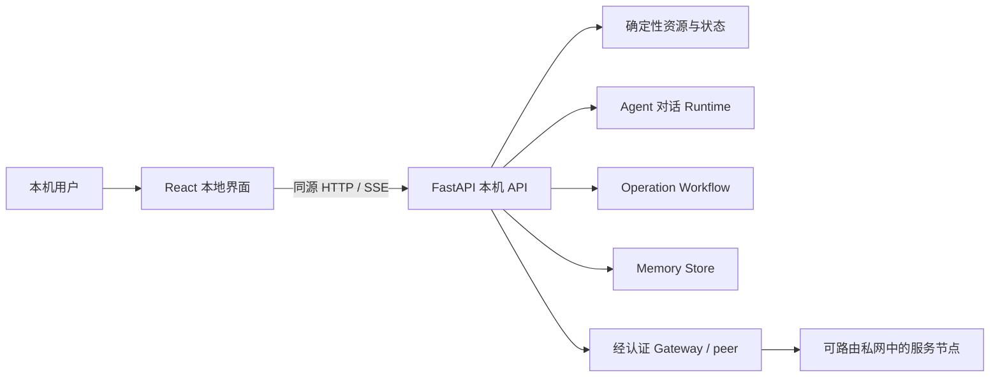
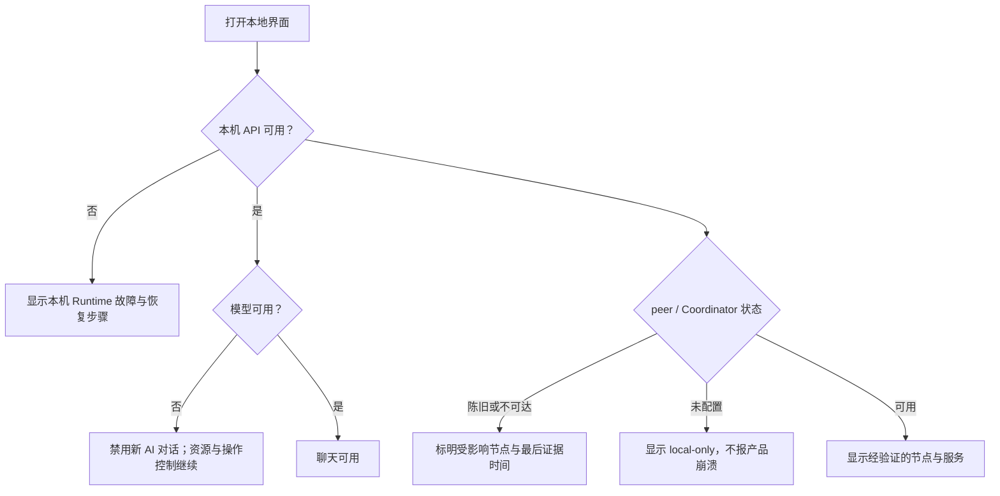

## Context

当前 `/chat`、`/resources`、`/operations` 和 `/memories` 分别由 Python 字符串内嵌页面实现。
它们证明了 API 和安全工作流可以运行，但缺少统一导航、共享状态模型、可访问交互、响应式布局和
面向普通用户的错误解释。后端已经区分本地 runtime、peer、模型、Coordinator、操作和记忆状态，
新前端的核心任务是忠实表达这些边界，而不是在浏览器中重新推断事实。

前端只面向节点本机用户，继续由环回 FastAPI 同源提供。Windows 与 macOS 是本 change 的真实
验收平台；Linux、安装器和自动升级仍是独立工作。产品设计与实现可以在 Figma 之外推进，外部
架构图额度不作为 React 源码开发工具依赖，但阶段关闭仍需遵守仓库的架构图同步门禁。

## Goals / Non-Goals

**Goals:**

- 使用 React + TypeScript 建立统一、可测试的本地产品界面。
- 以节点与服务总览为首页，并让聊天、审批、记忆和设置共享一致导航与状态语言。
- 明确区分“本机运行”“peer 可达”“模型可用”“Coordinator 新鲜”和“操作需批准”。
- 无模型或外部组件故障时继续提供确定性资源、已有操作控制和清晰降级说明。
- 保持所有远端文本为不可信数据，保持写操作的服务端授权、确认、幂等、验证和恢复边界。
- 让前端生产构建可重复地进入 Windows/macOS package，并可回退到旧页面。

**Non-Goals:**

- 不新增 Gateway、Coordinator、WireGuard、LAN discovery、relay 或防火墙协议。
- 不让页面监听非环回地址，不提供互联网托管版或多租户控制台。
- 不把浏览器状态当作授权，不在前端保存模型密钥、Gateway token 或临时访问凭据。
- 不交付安装器、自动升级、开机自启、Linux 包或整体品牌官网。
- 不重写后端领域模型，也不为了界面好看把陈旧、未知或离线状态伪装成正常。

## Decisions

### 1. 使用 React + TypeScript + Vite 的独立前端目录

前端源码放入独立目录并拥有锁文件、格式、类型、单元和生产构建命令。React 负责组合页面，
TypeScript 固定视图模型，Vite 只参与开发和构建；生产运行时不需要 Node.js。具体依赖版本在实现
开始时锁定并经过许可证与漏洞门禁。

选择 React 是用户已经确认的产品方向，也便于把 SSE、复杂操作状态和多页面导航拆成可测试组件。
否决继续扩展 Python 内嵌字符串，因为共享布局和交互状态会快速失控；否决在本 change 引入桌面
原生 UI，因为 Windows/macOS 双端复用和现有 FastAPI API 的成本更高。

### 2. 前端是现有后端的同源视图，不是新的控制面

React 应用只通过同源相对路径调用 API。服务端继续决定权限、状态迁移、幂等和可返回字段；前端
不得根据按钮是否可见推导授权。优先复用现有 API，只有当多个现有响应无法稳定表达一个页面状态
时才增加最小只读聚合接口，并为其补充 Python 契约测试。

### 3. 采用“总览优先、聊天核心、审批独立”的信息架构

- `Overview`：本机、节点、服务和关键依赖状态，提供下一步动作入口。
- `Chat`：线程、消息、公开工具轨迹、证据、取消与完成状态。
- `Operations`：待批准、执行中、需人工处理和历史记录；危险动作不混入普通资源卡片。
- `Memories`：来源、作用域、修正、删除和清空；与聊天记录明确分开。
- `Settings / Diagnostics`：模型和 Coordinator 的脱敏状态、版本、诊断导出入口，不显示秘密。

首版不建立可任意定制的 dashboard，也不引入复杂全局状态库。服务器状态使用查询缓存管理，URL
保存当前页面和可分享的非敏感筛选；临时表单状态留在组件内。

### 4. 把降级作为显式状态机，而不是统一的红色“离线”

状态标签必须来自服务端证据并显示最后更新时间。`local running` 不等于 `peer accepted`，
Coordinator 缓存不等于实时目录，模型失败也不阻断租约清理与已有操作控制。

### 5. SSE 使用可恢复、去重且可取消的公开事件模型

聊天页面根据公开事件序号记录最后已应用事件；断线重连时携带 `after`，忽略重复序号，不展示隐藏
推理。完成、失败、取消或用户离开当前 run 后关闭连接。浏览器刷新后从 run API 恢复公开状态，
不得自动重放工具或写操作。

### 6. 所有有副作用交互都以服务端状态为准

审批、拒绝、撤销、记忆修改和删除必须展示明确对象与影响，要求针对性确认，并在请求期间防止同一
按钮重复提交。前端收到超时或未知结果时重新读取 operation/memory 状态，不得自行假定成功。
完整授权、幂等、执行后验证、回滚和审计仍由现有后端负责。

### 7. 静态资源使用严格同源 CSP 和不可信文本渲染

生产构建使用带内容哈希的 JS/CSS；FastAPI 提供 SPA 入口和静态文件，响应采用 `no-store` 的入口
文档与可长期缓存的哈希资源。CSP 至少限制脚本、样式和连接到同源，禁止 object、base 和外部
frame。远端服务名、模型回答、工具结果和错误只作为文本渲染，不使用未经审计的 HTML 注入。

浏览器存储只允许非敏感显示偏好，不持久化 token、密钥、认证头、完整诊断包或待批准 payload。

### 8. 构建产物进入发布暂存区，不手工维护生成文件

仓库保存前端源码与锁文件。统一 package 命令先执行锁定依赖安装、前端测试和生产构建，再把
`dist` 复制到隔离发布暂存区，由 Python/package 构建清单收集。运行包验收必须在没有 Node.js、
源码 checkout 或网络的干净环境打开界面，证明 Node 只是构建依赖。

旧页面在 React A/B 验收完成前保留为不同路径的回退入口。切换默认入口后，如发现静态资源、CSP、
SSE 或操作控制回归，恢复旧入口映射即可，不删除用户数据或改变后端 API。

### 9. 可访问性和窄窗口是首版门禁

使用语义化 HTML、可见焦点、键盘导航、表单 label、状态文本和 `aria-live`；颜色不是唯一状态
信号。至少覆盖常见桌面窗口和窄窗口，不承诺完整移动端产品。自动规则、组件测试与两端浏览器
人工验收共同作为证据，不能只凭截图判断可用。

## Risks / Trade-offs

- [新增 Node 构建链增加依赖与供应链面积] → 锁定依赖、最小依赖集、许可证/漏洞扫描和离线产物验收。
- [前端把多个后端状态错误合并] → 视图模型保留来源、时间、新鲜度和稳定错误码，建立状态矩阵测试。
- [SSE 重连造成重复消息或泄漏连接] → 使用事件序号去重、显式关闭条件和 fake EventSource 测试。
- [旧 API 形状不适合产品界面] → 先做契约 spike；只增加最小聚合读模型，不在浏览器复制领域逻辑。
- [React 资源增大运行包] → 记录压缩前后体积与首次加载预算，禁止无收益的大型 UI 依赖。
- [视觉设计受 Figma MCP 额度影响] → 代码侧先用设计 token、组件故事和截图基线推进；架构阶段关闭前
  仍按 AGENTS.md 补齐主图核对，不把外部工具额度当作降低验收标准的理由。

## Migration Plan

1. 固定现有页面/API、状态矩阵、CSP 和 package 体积基线。
2. 建立 React 构建、类型、测试和静态资源服务 spike，不改变默认入口。
3. 实现统一外壳、总览和确定性降级，再依次迁移聊天、操作、记忆和设置。
4. 在 Windows/macOS 开发运行与版本化 package 中执行无模型、Coordinator 离线、peer 离线、
   SSE 重连、操作超时和窄窗口验收。
5. 保留旧页面并短时切换默认入口；失败立即恢复旧入口映射。
6. 通过真实用户流程和安全门禁后再决定旧页面的后续删除 change，本 change 不直接删除。

## Open Questions

- 第一版视觉语言采用项目自有轻量 token，还是选用无运行时样式依赖的组件基础库？实现前需用
  包体积、可访问性和维护成本 spike 定案。
- 浏览器验收固定 Chromium，还是同时把 WebKit 纳入每次 CI？至少 Windows/macOS 真机浏览器必须覆盖。
- 节点/服务首页是否需要首版搜索与排序，还是先以小型家庭/实验室规模的分组列表为准？
- 旧页面在 React 验收后保留几个版本，应与发布/回退策略一起确认。
